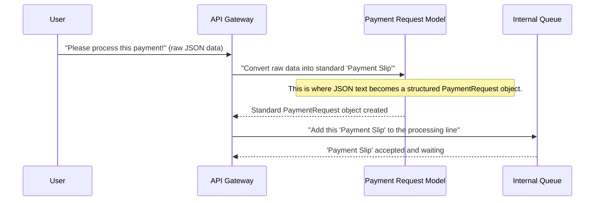

# Chapter 1: Payment Request Data Model

Welcome to the `rinha-backend-2025` tutorial! In this first chapter, we're going to explore the most basic, yet crucial, concept in our payment system: the **Payment Request Data Model**.

### What Problem Are We Solving?

Imagine you're trying to send a parcel. To make sure it gets to the right place, you use a standard shipping label. This label has clear spaces for the sender's address, the recipient's address, the weight, and so on. If every shipping company used a completely different label, sending a parcel would be a nightmare!

Our `rinha-backend-2025` system deals with payments. When a user wants to make a payment, this payment information needs to travel through many different parts of our system – from where it first arrives, to where it's stored temporarily, and finally to an external service that actually processes the money. If each part of our system expected the payment details in a different format, it would be chaotic and prone to errors.

The **Payment Request Data Model** solves this exact problem. Think of it as our standardized "payment slip" or "payment label." It's a blueprint that defines exactly what information a payment request must contain and how that information should be structured. This ensures that every service in our system understands and processes payment details uniformly, from start to finish.

### Our Core Use Case: Receiving a Payment

Let's consider our central use case: **A user wants to make a payment by sending a request to our system.** Our system needs to:
1.  Receive this request.
2.  Understand all the necessary details (like how much money and for whom).
3.  Prepare this information in a standardized way.
4.  Pass this standardized information to other parts of the system for processing.

The `Payment Request Data Model` is the key to step 3.

### What's Inside Our "Payment Slip"?

Our `PaymentRequest` data model is quite simple, but each piece of information is vital:

*   **`CorrelationID`**: This is like a unique tracking number for each payment. Just as a package has a tracking number, each payment request gets a `CorrelationID` so we can follow its journey through our system, check its status, and troubleshoot if needed.
*   **`Amount`**: This is the actual money value of the payment. For financial applications, using standard decimal numbers (like `10.50` or `123.45`) can sometimes lead to tiny, almost invisible errors in computer memory. To avoid this, we use a special type called `decimal.Decimal` which ensures super-accurate calculations for money, preventing any "missing cents" issues.
*   **`RequestedAt`**: This is a timestamp, recording the exact date and time when the payment request was originally made. It's crucial for logging, reporting, and understanding the timing of transactions.

### How Our System Uses the "Payment Slip"

When a user sends a payment request to our system (usually as a block of text in JSON format), the first thing our system does is convert that raw text into our structured `PaymentRequest` data model.

Here’s a simplified example of what a user's payment request might look like:

```json
{
  "correlationId": "payment-order-456",
  "amount": 75.20,
  "requestedAt": "2025-02-20T14:30:00Z"
}
```

Our system takes this JSON text and turns it into a Go programming language object that looks like our `PaymentRequest` "blueprint."

Let's look at a small, simplified piece of code from `infra/http/router.go` that shows how this happens:

```go
// From infra/http/router.go (simplified for clarity)
import (
	"github.com/gofiber/fiber/v2"
	"github.com/goccy/go-json"
	"niltonkummer/rinha-2025/pkg/models" // This line imports our PaymentRequest model
	"sync"
)

// This 'pool' helps us reuse PaymentRequest objects quickly.
// It's like having a stack of pre-printed "payment slips" ready to fill out.
var paymentPool = sync.Pool{}

func init() {
	// We tell the system how to create a new, blank PaymentRequest when needed.
	paymentPool.New = func() any {
		return &models.PaymentRequest{}
	}
}

// PaymentRequest handles incoming HTTP requests for payments.
func (r *Router) PaymentRequest(c *fiber.Ctx) error {
	// 1. Get a "blank" PaymentRequest object from our pool.
	// This is faster than creating a brand new one every time.
	var request = paymentPool.Get().(*models.PaymentRequest)
	// 2. IMPORTANT: After we're done with it, we return it to the pool
	// so it can be reused later. This is done automatically at the end.
	defer paymentPool.Put(request)

	// 3. Take the raw JSON text from the user's request (c.Body())
	// and fill in the fields of our 'request' PaymentRequest object.
	if err := json.Unmarshal(c.Body(), request); err != nil {
		// If the user's data isn't in the correct format, send an error back.
		return c.Status(fiber.StatusBadRequest).JSON(fiber.Map{"error": "Invalid request format"})
	}

	// At this point, 'request' is a perfectly formed PaymentRequest object!
	// It contains the CorrelationID, Amount, and RequestedAt, all structured
	// exactly as our system expects.
	// ... (This 'request' object is then passed to other parts of the system
	//      for further processing, which we'll cover in later chapters).

	return c.Status(204).Send(nil) // Send a "No Content" success message
}
```
*Explanation*: This code shows the first step of handling a payment request. Our web server receives the raw payment details. The key line `json.Unmarshal(c.Body(), request)` takes the text from the user's request and automatically fills in the `CorrelationID`, `Amount`, and `RequestedAt` fields of our `PaymentRequest` object. After this, we have a structured, easy-to-use `PaymentRequest` object ready for the next steps in the payment process. The `paymentPool` is a performance optimization for very busy systems, allowing us to reuse objects instead of constantly creating new ones.

### Inside the "Payment Slip" Factory

Let's look at the actual blueprint for our `PaymentRequest` data model, defined in `pkg/models/models.go`:

```go
// From pkg/models/models.go
package models

import (
	"github.com/shopspring/decimal" // Needed for precise money calculations
	"time"                         // Needed for timestamps (date and time)
)

// PaymentRequest defines the structure for a payment request.
// It's like a template for our standardized "payment slip".
type PaymentRequest struct {
	// `json:"correlationId"` tells Go that this field matches "correlationId" in JSON.
	CorrelationID string          `json:"correlationId"`
	// `json:"amount"` maps to "amount" in JSON, using our special decimal type.
	Amount        decimal.Decimal `json:"amount"`
	// `json:"requestedAt"` maps to "requestedAt" in JSON.
	RequestedAt   time.Time       `json:"requestedAt"`
}

// This small function helps the `decimal` package work nicely with JSON.
// You don't need to worry about the details for now!
func init() {
	decimal.MarshalJSONWithoutQuotes = true
}
```
*Explanation*: This is where we *define* the `PaymentRequest` type.
*   The `type PaymentRequest struct { ... }` block declares a new "structure" or "blueprint" named `PaymentRequest`.
*   Inside the curly braces `{}`, we list the pieces of information (fields) that every `PaymentRequest` will have: `CorrelationID`, `Amount`, and `RequestedAt`.
*   The text inside backticks, like `` `json:"correlationId"` ``, are called "tags." These tags are super important! They tell the Go language how to convert (or "marshal" and "unmarshal") this Go structure to and from JSON data. This is how the system knows that `CorrelationID` in our code corresponds to `correlationId` in the JSON text from the user.

### How the "Payment Slip" Moves Through the System

Once our `PaymentRequest` object is created and correctly filled, it doesn't just sit there. It gets passed along to other parts of our system for further processing. Here's a very simplified flow:

1.  **User sends a request**: A user (e.g., via a mobile app) sends payment details.
2.  **API Gateway receives**: Our system's entry point, the [API Gateway & HTTP Endpoint Handling](03_api_gateway___http_endpoint_handling_.md) component, gets this request.
3.  **Data becomes a `PaymentRequest`**: The raw text data is converted into our structured `PaymentRequest` data model.
4.  **Enqueued for processing**: This structured `PaymentRequest` is then sent to an internal waiting line, specifically an [In-Memory Data Store (Cache/Queue)](02_in_memory_data_store__cache_queue__.md) (a "queue"), to await processing.

Let's visualize this initial journey with a simple diagram:



### Why Is This Data Model So Important?

Having a clear and consistent `PaymentRequest` data model is absolutely fundamental for a robust payment system. Here's why:

| Feature                   | Benefit in `rinha-backend-2025`                                            | Real-World Analogy                                   |
| :------------------------ | :------------------------------------------------------------------------- | :--------------------------------------------------- |
| **Standardization**       | Ensures every service speaks the same "payment language."                  | All cars use the same type of fuel (gasoline/diesel). |
| **Clarity & Predictability** | It's always clear what information a payment requires.                     | A standard passport form has clear fields.           |
| **Reduced Errors**        | Consistent data format means fewer mistakes and easier debugging.          | Standardized electrical outlets reduce shock risk.   |
| **Easy Integration**      | Different parts of the system can easily exchange payment data.            | LEGO bricks snap together perfectly.                 |
| **Maintainability**       | Makes it simpler to update or add new features without breaking existing ones. | Replacing a standardized car part is easy.           |

### Conclusion

In this first chapter, we've laid the groundwork for understanding our payment system by exploring the **Payment Request Data Model**. We learned that it's our standardized "payment slip" that ensures all payment information (like unique ID, amount, and timestamp) is consistently understood across every part of `rinha-backend-2025`. This consistency is crucial for building a reliable and efficient system.

Now that we know how payment requests are structured, our next step is to understand how these "payment slips" are temporarily stored and managed within our system before they are fully processed. We'll dive into this in the next chapter.

[Next Chapter: In-Memory Data Store (Cache/Queue)](02_in_memory_data_store__cache_queue__.md)

---

<sub><sup>Generated by [AI Codebase Knowledge Builder](https://github.com/The-Pocket/Tutorial-Codebase-Knowledge).</sup></sub> <sub><sup>**References**: [[1]](https://github.com/niltonkummer/rinha-backend-2025/blob/8ad9de259efb7a27c8d1e005f4b1dc5996c2b7d1/infra/http/router.go), [[2]](https://github.com/niltonkummer/rinha-backend-2025/blob/8ad9de259efb7a27c8d1e005f4b1dc5996c2b7d1/pkg/models/models.go), [[3]](https://github.com/niltonkummer/rinha-backend-2025/blob/8ad9de259efb7a27c8d1e005f4b1dc5996c2b7d1/pkg/services/consumer/consumer.go), [[4]](https://github.com/niltonkummer/rinha-backend-2025/blob/8ad9de259efb7a27c8d1e005f4b1dc5996c2b7d1/pkg/services/handler/handler.go)</sup></sub>