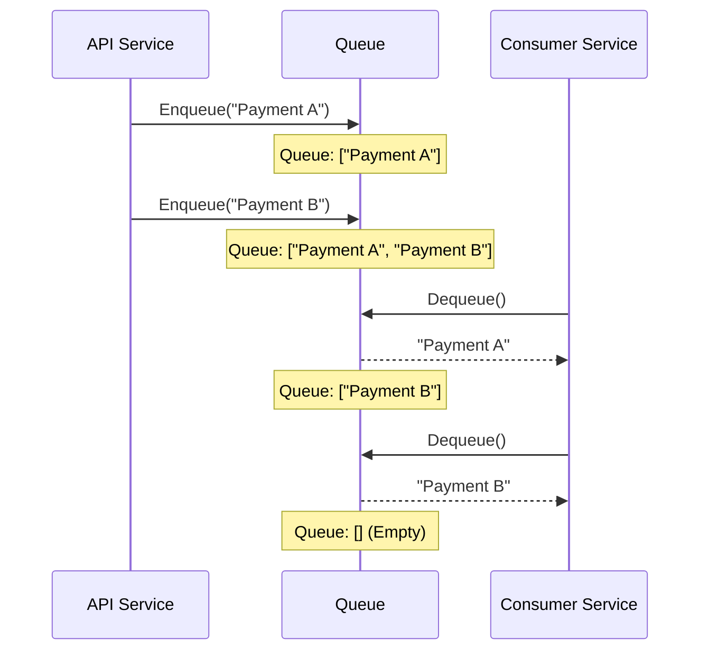
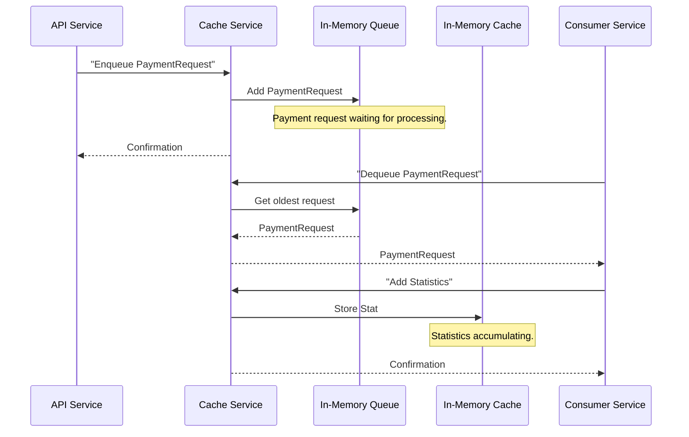

# Chapter 2: In-Memory Data Store (Cache/Queue)

Welcome back to the `rinha-backend-2025` tutorial! In [Chapter 1: Payment Request Data Model](01_payment_request_data_model_.md), we learned about our standardized "payment slip" – the `PaymentRequest` object. We saw how raw payment data from a user gets transformed into this clear, structured format.

Now that we have these structured `PaymentRequest` objects, what happens next? They need to be processed. But imagine a very busy system receiving thousands of payments every second. If our system tried to process each payment immediately and fully, it might get overwhelmed and slow down, making users wait.

### What Problem Are We Solving?

Think of our payment system as a busy kitchen in a popular restaurant. When a new food order (a `PaymentRequest`) comes in, the chef (our payment processor) can't cook everything at once. What happens? The order is usually written down and put on a "waiting list" or "order queue" for the chef to pick up when they're ready.

Similarly, our system needs a fast, temporary "holding area" or "to-do list" for payment requests. This is where the **In-Memory Data Store** comes in. It's a special place in our computer's super-fast memory (RAM) where we can quickly put new payment requests and also keep track of temporary information like statistics.

Our central use case for this chapter is: **To efficiently manage incoming payment requests and temporary statistics, allowing for fast, asynchronous processing.**

### Core Concept 1: The Queue (Our To-Do List)

The first part of our In-Memory Data Store is the **Queue**.
Imagine a line of people waiting to buy tickets. The first person in line is the first one to get a ticket. This is exactly how a queue works in computer science: it's a "First-In, First-Out" (FIFO) system.

*   **`Enqueue`**: When a new `PaymentRequest` arrives from the [API Gateway & HTTP Endpoint Handling](03_api_gateway___http_endpoint_handling_.md), we `Enqueue` it. This means we add it to the end of our waiting line.
*   **`Dequeue`**: When our system is ready to process a payment, it `Dequeue`s one. This means it takes the `PaymentRequest` from the very front of the line.

**Why "In-Memory"?** Because it lives directly in the computer's RAM, adding to and taking from this queue is incredibly fast, much faster than writing to a hard drive or a database. This speed is crucial for handling many requests without slowing down.

#### How Our System Uses the Queue

The `api` service receives the payment request from the user and immediately `Enqueues` it. This is like the waiter taking your order and putting it on the kitchen's "order queue." This way, the user's request is handled very quickly, and they don't have to wait for the actual cooking (payment processing) to finish. Later, our `consumer` service (the "chef") will continuously `Dequeue` these requests and process them.

Let's see how our system `Enqueues` a payment request.

```go
// From pkg/services/handler/handler.go (simplified)

// PaymentHandler manages operations related to payments.
type PaymentHandler struct {
	queue adapters.QueueAdapter // Our connection to the queue
	// ... other fields
}

// HandlePaymentRequest takes a payment and adds it to the queue.
func (h *PaymentHandler) HandlePaymentRequest(ctx context.Context, request models.PaymentRequest) error {
	// This line adds the payment request to our in-memory queue.
	return h.queue.Enqueue(ctx, &request)
}
```
*Explanation*: The `HandlePaymentRequest` function (which receives our `PaymentRequest` object from the API) doesn't process the payment directly. Instead, it uses `h.queue.Enqueue` to quickly add the `request` to our internal queue. This happens very fast!

Now, how does our system get a payment request from the queue to process it?

```go
// From pkg/services/handler/handler.go (simplified)

// DequeuePaymentRequest gets the next payment request from the queue.
func (h *CacheHandler) DequeuePaymentRequest(ctx context.Context) (*models.PaymentRequest, error) {
	// This line takes the next payment request from the front of the queue.
	request, err := h.queue.Dequeue(ctx)
	if err != nil {
		return nil, err
	}

	// If the queue was empty, it might return nil.
	if request == nil {
		return nil, nil
	}

	// We know it's a PaymentRequest, so we convert its type.
	return request.(*models.PaymentRequest), nil
}
```
*Explanation*: The `DequeuePaymentRequest` function uses `h.queue.Dequeue` to retrieve the oldest `PaymentRequest` that was added to the queue. This is how the `consumer` service gets its next "task" to work on. There's also `DequeueBatch` which can take multiple items at once, which is even more efficient!

#### Inside the Queue

Let's peek under the hood at how our queue works. At its heart, it's a simple list (a "slice" in Go) in memory.

When you `Enqueue` a request:
1.  The system adds the `PaymentRequest` to the end of its internal list.
2.  It uses a "lock" (`sync.Mutex`) to make sure only one operation happens at a time, preventing data mix-ups if many requests come in at once.

When you `Dequeue` a request:
1.  The system takes the first `PaymentRequest` from the beginning of its internal list.
2.  It removes that item from the list.
3.  Again, it uses a "lock" for safety.

Here's a simplified view of the internal logic:



Now, let's look at the actual code for our `Queue` implementation:

```go
// From pkg/services/cache/queue.go (simplified)
package cache

import (
	"context"
	"sync" // Used for the "lock" to prevent chaos!
)

type queueImpl struct {
	data []any      // This is our internal list where items are stored.
	sync.Mutex      // Our "lock" to keep things orderly.
}

// NewQueue creates a new, empty queue.
func NewQueue(size int) Queue {
	return &queueImpl{
		data: make([]any, 0, size), // Starts with an empty list.
	}
}

// Enqueue adds an item to the end of our list.
func (q *queueImpl) Enqueue(ctx context.Context, body any) error {
	q.Lock()   // Grab the lock, no one else can touch the list for a moment.
	defer q.Unlock() // Release the lock when done.
	q.data = append(q.data, body) // Add the new item to the end.
	return nil
}

// Dequeue removes the first item from the list.
func (q *queueImpl) Dequeue(ctx context.Context) (any, error) {
	q.Lock()   // Grab the lock.
	defer q.Unlock() // Release the lock.
	if len(q.data) == 0 {
		return nil, nil // If the list is empty, nothing to dequeue!
	}
	body := q.data[0]       // Get the first item.
	q.data = q.data[1:]     // Remove the first item by making a new list without it.
	return body, nil
}
```
*Explanation*: This code defines our `queueImpl`. The `data` field is simply a Go `slice` (like a flexible array) where we store our items. The `sync.Mutex` is crucial for multi-threaded programs. It ensures that when one part of our system is adding or removing items from the queue, no other part tries to do the same thing at the exact same time, which could mess up the list. `q.Lock()` grabs the lock, and `defer q.Unlock()` ensures it's released automatically when the function finishes.

### Core Concept 2: The Cache (Our Temporary Notepad)

The second part of our In-Memory Data Store is the **Cache**. Unlike a queue, a cache isn't primarily for processing tasks in order. Instead, it's a temporary storage area for information that needs to be accessed quickly, like performance statistics.

Imagine a "scratchpad" or a temporary "bulletin board" where different parts of your system can quickly jot down notes. When you need a summary of those notes, you can quickly read them all.

*   **`Add`**: When our system collects a piece of information (like a statistic about a payment), it `Add`s it to the cache.
*   **`GetList`**: When we need to see all the collected statistics for a report, we call `GetList`.

**Why "In-Memory"?** Again, speed! Storing and retrieving temporary statistics from memory is super fast, allowing us to gather a lot of data without slowing down our main payment processing. This data is not meant for long-term storage or permanent records; it's just for quick, real-time insights (which we'll explore in [Real-time Performance Statistics](07_real_time_performance_statistics_.md)).

#### How Our System Uses the Cache

Our `consumer` service, after successfully processing a payment, sends statistics about that payment to the `cache` service. Later, if we need to see a summary of recent payment activity, we can query this cache.

Here's how statistics are added to the cache:

```go
// From pkg/services/handler/handler.go (simplified)

// CacheHandler manages operations for the in-memory cache and queue.
type CacheHandler struct {
	cache adapters.Cache // Our connection to the cache
	// ... other fields
}

// AddStat takes a statistic and adds it to the cache.
func (h *CacheHandler) AddStat(stats *models.StatsRPC) {
	// This line adds the collected statistic to our in-memory cache.
	h.cache.Add(stats)
}
```
*Explanation*: When a statistic (`models.StatsRPC`) is generated (e.g., after a payment is successfully processed), the `AddStat` function is called, which then uses `h.cache.Add` to quickly store it in the in-memory cache.

And how we retrieve the list of statistics for analysis:

```go
// From pkg/services/handler/handler.go (simplified)

// GetStats retrieves statistics from the cache for a given time period.
func (h *CacheHandler) GetStats(start, end time.Time) (*models.PaymentsSummaryResponse, error) {
	// Get all items currently stored in the cache.
	list, err := h.cache.GetList()
	if err != nil {
		return nil, err
	}

	// Loop through the collected stats to calculate summaries.
	for _, item := range list {
		// ... (logic to filter by time and calculate totals) ...
	}
	// ...
	return &models.PaymentsSummaryResponse{}, nil
}
```
*Explanation*: The `GetStats` function uses `h.cache.GetList` to fetch all currently stored statistics. It then iterates through them to calculate summary information (like total requests or amounts) within a specific time range.

#### Inside the Cache

Similar to the queue, our cache is also backed by a simple Go `slice` in memory.

When you `Add` an item:
1.  The system appends the item to its internal list.
2.  It uses a "lock" (`sync.Mutex`) for thread safety.

When you `GetList`:
1.  The system creates a *copy* of its internal list.
2.  It returns this copy. (It returns a copy so that other operations can still safely `Add` to the original list without conflicts.)
3.  Again, it uses a "lock" for safety during the copy process.

Here's the simplified code for our `CacheService`:

```go
// From pkg/services/cache/cache.go (simplified)
package cache

import (
	"sync" // Also used for the "lock" here!
)

type CacheService struct {
	cache []any   // Our internal list for cached items.
	sync.Mutex    // Our "lock" for safety.
}

// NewCacheService creates a new, empty cache.
func NewCacheService(size int) *CacheService {
	return &CacheService{
		cache: make([]any, 0, size), // Starts empty.
	}
}

// Add appends an item to the cache.
func (cs *CacheService) Add(value any) {
	cs.Lock()   // Grab the lock.
	defer cs.Unlock() // Release the lock.
	cs.cache = append(cs.cache, value) // Add to the end of the list.
}

// GetList returns a copy of all items currently in the cache.
func (cs *CacheService) GetList() ([]any, error) {
	cs.Lock()   // Grab the lock.
	defer cs.Unlock() // Release the lock.
	copyCache := make([]any, len(cs.cache)) // Create a new list of the same size.
	copy(copyCache, cs.cache)             // Copy all items from original to new list.
	return copyCache, nil
}
```
*Explanation*: The `CacheService` also uses a `slice` (`cache`) and a `sync.Mutex` for safe access. The `Add` method is straightforward, just appending. `GetList` is a bit more involved because it creates a *copy* of the internal data. This is good practice to prevent external parts of the system from accidentally changing the data directly while the cache service is still using it.

### Putting It All Together: The `cache` Service

Both our Queue and our Cache live inside a dedicated part of our system called the **`cache` service**.

Why have a separate `cache` service?
*   **Specialization**: It focuses solely on managing this in-memory data, making its job clear and simple.
*   **Decoupling**: The `api` and `consumer` services don't need to know the complex details of how the queue or cache work internally. They just send requests to the `cache` service, like sending a letter to a post office without knowing how the mail is sorted.
*   **Scalability**: In advanced setups, you could potentially have multiple `cache` services or run it on a powerful machine dedicated to memory operations.

Here's how the `cache` service is started in our system:

```go
// From cmd/main.go (simplified)
func cacheService(ctx context.Context) {

	// Create instances of our Queue and Cache services.
	cacheAdapter := cache.NewCacheService(20000) // For statistics
	queue := cache.NewQueue(20000)             // For payment requests

	// Create a handler that uses these Queue and Cache instances.
	cacheHandler := handler.NewCacheHandler(cacheAdapter, queue, slog.Default())

	// Start an RPC server to expose these services to other parts of the system.
	server := rpc.NewRPCServer(log)
	err := server.Start(ctx, config.RPCAddr, cacheHandler.HandleRPC)
	if err != nil {
		log.Error("error on start cache service", "err", err)
	}
}
```
*Explanation*: This `cacheService` function is run when our program starts in "cache" mode. It first creates our `CacheService` and `Queue` objects. Then, it creates a `CacheHandler` which knows how to interact with both the queue and the cache. Finally, it starts an `RPC Server` (which we'll learn about in [Inter-Service RPC Communication](04_inter_service_rpc_communication_.md)) to allow other services (like `api` and `consumer`) to communicate with this `cache` service and use its queue and cache functionalities.

Here's an overall diagram of how the `api` and `consumer` services interact with the `cache` service's in-memory data store:



### Key Benefits of an In-Memory Data Store (Cache/Queue)

Using this approach provides significant advantages for `rinha-backend-2025`:

| Feature               | Benefit in `rinha-backend-2025`                                                               | Real-World Analogy                                           |
| :-------------------- | :-------------------------------------------------------------------------------------------- | :----------------------------------------------------------- |
| **Speed**             | Extremely fast storage and retrieval because it uses RAM.                                     | Using a super-fast in-person express lane instead of slow mail. |
| **Asynchronous Processing** | The `api` doesn't wait for payments to fully process; it just queues them.                | A restaurant taking orders quickly, cooking them in the background. |
| **Decoupling**        | `api` and `consumer` don't directly interact, making the system more flexible.              | Waiters and chefs have separate, clear roles.                 |
| **Load Balancing**    | Handles bursts of requests by queuing them, smoothing out the workload for processors.       | A waiting line prevents too many customers from overwhelming the cashier at once. |
| **Temporary Storage** | Great for temporary tasks (payments) and quick insights (stats), not for permanent records. | A scratchpad for quick notes, not a permanent ledger.         |

### Conclusion

In this chapter, we've explored the **In-Memory Data Store**, understanding its two key components: the **Queue** for managing pending payment requests and the **Cache** for temporarily storing statistics. We learned that these components live within the `cache` service, acting as a super-fast, temporary "holding area" that enables our system to handle many requests efficiently and asynchronously. This means the `api` can quickly receive payments, and the `consumer` can process them at its own pace, without making the user wait.

Now that we know how payment requests are structured and how they are temporarily stored, our next step is to understand how these requests first arrive at our system from the outside world. We'll dive into this in the next chapter.

[Next Chapter: API Gateway & HTTP Endpoint Handling](03_api_gateway___http_endpoint_handling_.md)

---

<sub><sup>Generated by [AI Codebase Knowledge Builder](https://github.com/The-Pocket/Tutorial-Codebase-Knowledge).</sup></sub> <sub><sup>**References**: [[1]](https://github.com/niltonkummer/rinha-backend-2025/blob/8ad9de259efb7a27c8d1e005f4b1dc5996c2b7d1/cmd/main.go), [[2]](https://github.com/niltonkummer/rinha-backend-2025/blob/8ad9de259efb7a27c8d1e005f4b1dc5996c2b7d1/pkg/services/cache/cache.go), [[3]](https://github.com/niltonkummer/rinha-backend-2025/blob/8ad9de259efb7a27c8d1e005f4b1dc5996c2b7d1/pkg/services/cache/queue.go), [[4]](https://github.com/niltonkummer/rinha-backend-2025/blob/8ad9de259efb7a27c8d1e005f4b1dc5996c2b7d1/pkg/services/handler/handler.go)</sup></sub>