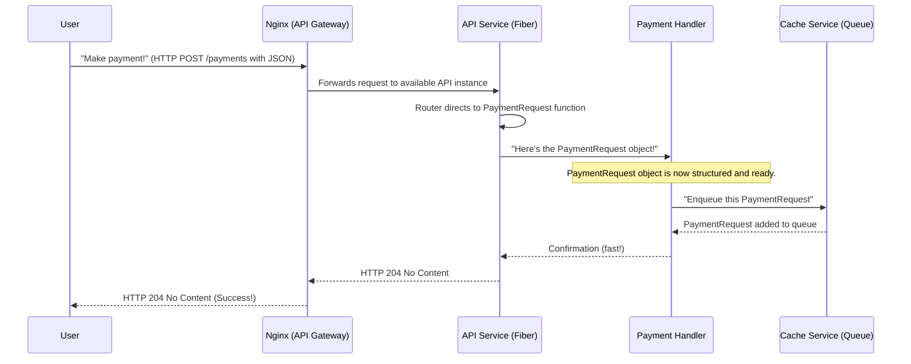

# Chapter 3: API Gateway & HTTP Endpoint Handling

Welcome back to the `rinha-backend-2025` tutorial! In [Chapter 1: Payment Request Data Model](01_payment_request_data_model_.md), we defined our standardized "payment slip"—the `PaymentRequest` object. Then, in [Chapter 2: In-Memory Data Store (Cache/Queue)](02_in_memory_data_store__cache_queue__.md), we learned how these `PaymentRequest` objects are temporarily stored in a super-fast queue, waiting to be processed.

But how do these payment requests even *get* into our system in the first place? They don't magically appear! They arrive from users (like you, on your phone or computer) through the internet. This chapter is about how our system acts as a friendly "front door" to welcome these requests.

### What Problem Are We Solving?

Imagine our payment system is a very popular restaurant.
1.  **Many Customers:** Many people want to make payments at the same time. We need a way to welcome all of them and direct them efficiently.
2.  **Different Orders:** Customers don't all want the same thing. Some want to "make a payment," while others want to "check their payment history." We need different "counters" or "sections" for these different requests.
3.  **Protection:** We also want to protect our kitchen (our internal processing services) from being overwhelmed directly by too many customers at once.

The **API Gateway & HTTP Endpoint Handling** solves these problems. It's the "front of the house" for our system, ensuring that user requests are received, understood, and directed to the right place for processing.

Our central use case for this chapter is: **A user sends an HTTP request to our system to make a payment or query a summary of payments.** Our system needs to:
1.  Receive the request safely and efficiently.
2.  Know what kind of request it is (e.g., "make payment" or "get summary").
3.  Pass the request details to the correct internal part of the system.

### Core Concept 1: The API Gateway (Nginx)

Think of the **API Gateway** as the main entrance and reception area of our restaurant. When you arrive, you first talk to the host or hostess. They decide which table (which server) you'll go to.

In `rinha-backend-2025`, our API Gateway is powered by **Nginx** (pronounced "engine-x").
*   **What it is:** Nginx is a very popular and super-fast "reverse proxy." This means it sits in front of our main application services. Instead of you talking directly to our payment processing "kitchen," you talk to Nginx first.
*   **Why we use it:**
    *   **Traffic Director:** Nginx looks at incoming requests and directs them to one of our running `api` services. If we have multiple `api` services (like `api1` and `api2` in our setup), Nginx helps spread the work evenly, so no single `api` service gets too busy. This is called *load balancing*.
    *   **Protection:** It adds a layer of protection, shielding our internal services from direct public access.

Let's look at how Nginx is set up in our project using `docker-compose.yml`:

```yaml
# From docker-compose.yml (simplified)
services:
  api1:
    # ... definition for api1 service ...
  api2:
    # ... definition for api2 service ...

  nginx:
    image: nginx:1.25-alpine
    container_name: rinha-nginx
    volumes:
      - ./infra/nginx.conf:/etc/nginx/nginx.conf:ro # Nginx uses this file for rules
    depends_on:
      - api1 # Nginx needs api1 to be running
      - api2 # Nginx needs api2 to be running
    ports:
      - "9999:80" # This means Nginx listens on port 9999 from outside
    networks:
      - backend-network # Nginx talks to api1/api2 on this network
```
*Explanation*: This part of our `docker-compose.yml` file sets up the `nginx` service. The `ports: - "9999:80"` line is crucial: it means that users connect to our system on port `9999` (e.g., `http://localhost:9999`), and Nginx listens on its internal port `80`. Nginx then knows how to forward these requests to `api1` or `api2` based on rules defined in the `infra/nginx.conf` file (which tells Nginx which `api` service to send requests to). The `depends_on` ensures that our `api` services are ready before Nginx starts directing traffic.

### Core Concept 2: HTTP Endpoint Handling (Fiber)

Once Nginx directs a customer to one of our `api` services (e.g., `api1`), that `api` service is responsible for taking the order. This is where **HTTP Endpoint Handling** comes in.

In `rinha-backend-2025`, our `api` service uses a Go web framework called **Fiber**.
*   **What it is:** Fiber helps us define specific "addresses" or "paths" (called **endpoints** or **routes**) that users can send requests to.
*   **Why we use it:**
    *   **Clear Paths:** It allows us to set up different "counters" for different types of requests. For example, `/payments` for making a payment, and `/payments-summary` for checking statistics.
    *   **Request Processing:** Fiber helps us easily read the data users send (like the JSON for a payment), convert it into our structured `PaymentRequest` model (as we saw in [Chapter 1](01_payment_request_data_model_.md)), and then pass it along to the next part of our system.

Let's see how our `api` service defines these endpoints using Fiber:

```go
// From infra/http/router.go (simplified)
package http

import (
	"github.com/gofiber/fiber/v2" // Our web framework!
	"niltonkummer/rinha-2025/pkg/services/handler" // Where our payment logic lives
	"time"
)

type Router struct {
	App     *fiber.App
	Handler *handler.PaymentHandler // Our link to the payment processing logic
}

func NewRouter(paymentHandler *handler.PaymentHandler) *Router {
	app := fiber.New(fiber.Config{}) // Create a new Fiber application
	return &Router{
		App:     app,
		Handler: paymentHandler,
	}
}

// RegisterRoutes sets up all the web addresses (endpoints) our system responds to.
func (r *Router) RegisterRoutes() {
	// 1. A route for checking if the service is alive.
	r.App.Get("/health", r.HealthCheck)

	// 2. A route for users to submit new payments.
	// When someone POSTs data to /payments, the PaymentRequest function handles it.
	r.App.Post("/payments", r.PaymentRequest)

	// 3. A route for users to get a summary of payments.
	// When someone GETs data from /payments-summary, the PaymentsSummary function handles it.
	r.App.Get("/payments-summary", r.PaymentsSummary)
}
```
*Explanation*: The `RegisterRoutes` function is where we tell Fiber what URLs (`/health`, `/payments`, `/payments-summary`) our system should listen to, and what Go function (`HealthCheck`, `PaymentRequest`, `PaymentsSummary`) should run when a request arrives at that URL. `r.App.Post` means it expects data to be *sent* (like submitting a form), while `r.App.Get` means it expects to *receive* data (like visiting a webpage).

#### Handling a Payment Request

When a user sends a `POST` request to `/payments`, our `PaymentRequest` function (inside `infra/http/router.go`) takes over. This is where the raw JSON data from the user gets transformed into our structured `PaymentRequest` model, and then quickly sent to the queue.

```go
// From infra/http/router.go (simplified)
import (
	"github.com/goccy/go-json" // To convert JSON to Go objects
	"github.com/gofiber/fiber/v2"
	"niltonkummer/rinha-2025/pkg/models" // Imports our PaymentRequest model
	"sync"
	"net/http"
)

// This 'paymentPool' is for performance, allowing us to reuse PaymentRequest objects.
// (We talked about this in Chapter 1!)
var paymentPool = sync.Pool{}
func init() {
	paymentPool.New = func() any { return &models.PaymentRequest{} }
}
func getPaymentFromPool() *models.PaymentRequest {
	return paymentPool.Get().(*models.PaymentRequest)
}

// PaymentRequest handles incoming HTTP requests for payments.
func (r *Router) PaymentRequest(c *fiber.Ctx) error {
	// 1. Get a blank PaymentRequest object from our pool.
	var request = getPaymentFromPool()
	defer paymentPool.Put(request) // Put it back when we're done

	// 2. Take the raw JSON text from the user's request (c.Body())
	// and fill in the fields of our 'request' PaymentRequest object.
	if err := json.Unmarshal(c.Body(), request); err != nil {
		// If the user's data isn't in the correct format, send an error.
		return c.Status(fiber.StatusBadRequest).JSON(fiber.Map{"error": "Invalid request format"})
	}

	// At this point, 'request' is a perfectly formed PaymentRequest object!
	// 3. Now, pass this structured request to our handler to be added to the queue.
	err := r.Handler.HandlePaymentRequest(c.Context(), *request)
	if err != nil {
		// If something went wrong while handling (e.g., adding to queue), send an error.
		return c.Status(fiber.StatusInternalServerError).JSON(fiber.Map{"error": "Failed to process payment request"})
	}

	// 4. Send a success message back to the user.
	return c.Status(http.StatusNoContent).Send(nil)
}
```
*Explanation*: This function is the "order taker" for payments. It receives the raw request from the user.
1.  It quickly grabs a ready-to-use `PaymentRequest` object from the `paymentPool` (a performance trick from [Chapter 1](01_payment_request_data_model_.md)).
2.  `json.Unmarshal(c.Body(), request)` is the magical line that reads the JSON data from the user's request and automatically fills in our `PaymentRequest` object (`CorrelationID`, `Amount`, `RequestedAt`). If the JSON is badly formatted, it sends an error.
3.  `r.Handler.HandlePaymentRequest(c.Context(), *request)` then passes this nicely structured `PaymentRequest` to our `PaymentHandler`. As we learned in [Chapter 2](02_in_memory_data_store__cache_queue__.md), `HandlePaymentRequest` immediately puts this payment request into our in-memory queue, so the user doesn't have to wait for the actual payment processing.
4.  Finally, `c.Status(http.StatusNoContent).Send(nil)` sends a quick "okay, got it!" message back to the user, without sending any additional data.

#### Handling a Payments Summary Request

Similarly, when a user sends a `GET` request to `/payments-summary`, our `PaymentsSummary` function (in `infra/http/router.go`) takes over. This retrieves statistics from our in-memory cache.

```go
// From infra/http/router.go (simplified)

// PaymentsSummary handles the payments summary endpoint.
func (r *Router) PaymentsSummary(c *fiber.Ctx) error {
	// (Code to read 'from' and 'to' date/time from the user's request query parameters)
	// For example, a request might look like: /payments-summary?from=2025-01-01T00:00:00Z&to=2025-01-31T23:59:59Z

	// Call our handler to get the summary from the cache.
	summary, err := r.Handler.HandlePaymentsSummary(from.UTC(), to.UTC())
	if err != nil {
		return c.Status(fiber.StatusInternalServerError).JSON(fiber.Map{
			"error": "Failed to fetch payments summary",
		})
	}

	// Send the summary data back to the user as JSON.
	return c.JSON(summary)
}
```
*Explanation*: This function is the "information desk." It might read date and time filters from the user's request (e.g., "show me payments from January"). It then calls `r.Handler.HandlePaymentsSummary`. As we saw in [Chapter 2](02_in_memory_data_store__cache_queue__.md), this function retrieves the accumulated statistics from our in-memory cache and returns a nicely summarized report, which Fiber then converts into JSON and sends back to the user.

### The Full Journey: From User to Queue

Let's visualize the entire journey of a payment request from the moment a user clicks "send" until it's safely waiting in our internal queue:



### Why Is This Setup So Important?

Having a dedicated API Gateway (Nginx) and clear HTTP Endpoint Handling (Fiber) at the front of our system provides many benefits:

| Feature                   | Benefit in `rinha-backend-2025`                                            | Real-World Analogy                                   |
| :------------------------ | :------------------------------------------------------------------------- | :--------------------------------------------------- |
| **Unified Entry Point**   | All requests come through one place, simplifying client interactions.      | One main entrance to a large building.               |
| **Load Balancing**        | Distributes requests across multiple `api` services, preventing overload.  | A restaurant hostess directing customers to available tables. |
| **Clear API Definition**  | Provides specific, well-defined URLs for different actions.                | Clearly marked counters for "Orders" vs. "Information." |
| **Request Validation**    | Can quickly check if incoming data is in the correct format.               | A waiter checking if your order form is filled correctly. |
| **System Stability**      | Shields internal services from direct public internet access.              | Security guards at the front door.                   |
| **Scalability**           | Easy to add more `api` instances as traffic grows.                         | Can add more tables and waiters to a busy restaurant. |

### Conclusion

In this chapter, we've explored the "front door" of our `rinha-backend-2025` system: the **API Gateway** (Nginx) and **HTTP Endpoint Handling** (Fiber). We learned how Nginx acts as a traffic director, sending user requests to available `api` services, and how Fiber within the `api` service defines specific URLs (endpoints) for actions like making payments or querying summaries. This setup ensures our system can efficiently receive, understand, and quickly forward user requests, laying the groundwork for the next steps in our payment processing pipeline.

Now that we understand how requests enter our system and are briefly processed by the `api` service, our next step is to explore how our different services communicate with each other behind the scenes to get the actual work done. We'll dive into this in the next chapter.

[Next Chapter: Inter-Service RPC Communication](04_inter_service_rpc_communication_.md)

---

<sub><sup>Generated by [AI Codebase Knowledge Builder](https://github.com/The-Pocket/Tutorial-Codebase-Knowledge).</sup></sub> <sub><sup>**References**: [[1]](https://github.com/niltonkummer/rinha-backend-2025/blob/8ad9de259efb7a27c8d1e005f4b1dc5996c2b7d1/cmd/main.go), [[2]](https://github.com/niltonkummer/rinha-backend-2025/blob/8ad9de259efb7a27c8d1e005f4b1dc5996c2b7d1/docker-compose.yml), [[3]](https://github.com/niltonkummer/rinha-backend-2025/blob/8ad9de259efb7a27c8d1e005f4b1dc5996c2b7d1/infra/http/router.go), [[4]](https://github.com/niltonkummer/rinha-backend-2025/blob/8ad9de259efb7a27c8d1e005f4b1dc5996c2b7d1/pkg/services/handler/handler.go)</sup></sub>