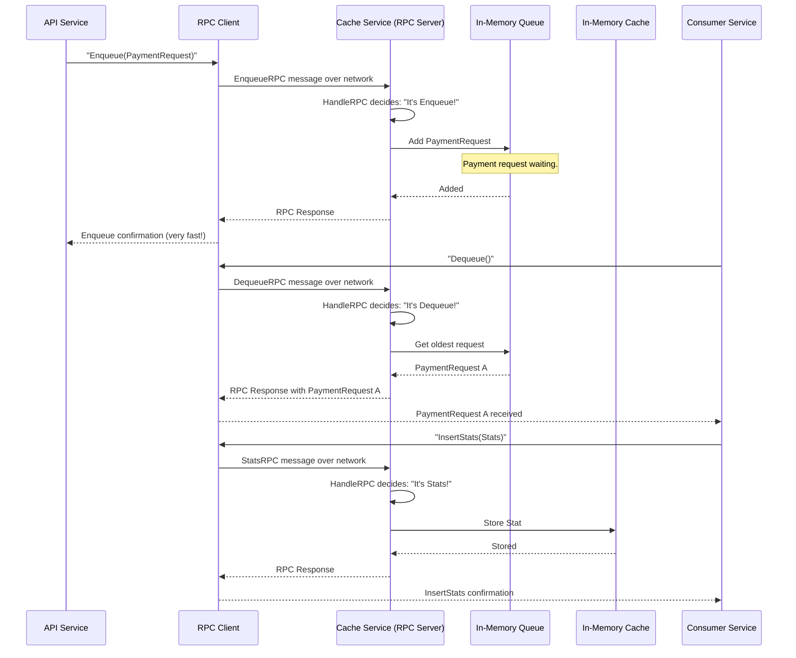

# Chapter 4: Inter-Service RPC Communication

Welcome back to the `rinha-backend-2025` tutorial! In [Chapter 1: Payment Request Data Model](01_payment_request_data_model_.md), we learned about our `PaymentRequest` "payment slip." In [Chapter 2: In-Memory Data Store (Cache/Queue)](02_in_memory_data_store__cache_queue__.md), we explored how these payment requests are stored temporarily in a super-fast queue within our dedicated `cache` service. And in [Chapter 3: API Gateway & HTTP Endpoint Handling](03_api_gateway___http_endpoint_handling_.md), we saw how user requests enter our system through Nginx and our `api` service.

But here's a crucial question: How do our different internal services, like the `api` service (which receives user requests) and the `consumer` service (which processes payments), actually *talk* to our `cache` service? They are all separate programs running in their own "boxes." They can't just directly access each other's memory!

### What Problem Are We Solving?

Imagine you have a team of people working on different floors of a building:
*   The "Order Takers" (our `api` service) are on the first floor.
*   The "Kitchen Staff" (our `consumer` service) are in the basement.
*   The "Storage Room" (our `cache` service, with its queue and statistics) is on the third floor.

When an "Order Taker" gets a new food order, they need to tell the "Storage Room" to add it to the waiting list. When the "Kitchen Staff" is ready to cook, they need to ask the "Storage Room" for the next order. And when they finish cooking, they might want to tell the "Storage Room" to update the daily statistics.

How do they communicate? They could send emails, but that's slow. They could shout across the floors, but that's messy. What they need is a fast, direct "phone line" between their offices.

Our `rinha-backend-2025` system solves this problem using **Inter-Service RPC Communication**. This is the dedicated "phone line" that allows different parts of our backend (like the `api` and `consumer` services) to talk directly and quickly to the `cache` service. Instead of slower methods like message queues for direct requests, they use `gorpc` as this fast, lightweight "direct phone line."

Our central use case for this chapter is: **The `api` service needs to tell the `cache` service to `Enqueue` a new payment request, and the `consumer` service needs to tell the `cache` service to `Dequeue` payments for processing. Both also need to `Add` or `Retrieve` statistics from the `cache` service.**

### Core Concept: RPC (Remote Procedure Call)

RPC stands for **Remote Procedure Call**. It's a fancy way of saying: "calling a function that exists on another computer (or another part of your system) as if it were a function right here on your own computer."

Think of it like this:
*   You are the `api` service.
*   Your friend is the `cache` service, sitting at another desk.
*   Your friend has a special "add to queue" machine.

Instead of yelling "Hey friend, add this payment to your queue!", you simply pick up your phone and say "Friend, use your `add_to_queue` function with this payment information." Your friend's phone rings, their `add_to_queue` function magically runs, and they reply "Done!".

That's RPC in a nutshell! It makes interacting with other services feel almost like calling a regular function within your own code, but it happens across the network.

In `rinha-backend-2025`, we use a special Go library called **`gorpc`**. It's designed to be very fast and efficient for this kind of direct service-to-service communication.

### How Our Services "Call" Each Other (The Client Side)

Let's look at how the `api` and `consumer` services make calls to the `cache` service. They act as **RPC Clients**.

First, they need a "phone" to make calls. This is the `gorpc.NewTCPClient`.

```go
// From cmd/main.go (simplified for api service)

func api(ctx context.Context) {
    // This creates our "phone" (RPC client)
	rpcClient := gorpc.NewTCPClient(config.RPCAddr)
	rpcClient.Conns = 30 // Can make 30 calls at once!
	rpcClient.Start()    // Start listening for replies

    // ... other setup ...
}
```
*Explanation*: The `api` service (and `consumer` service, which has similar code) first sets up a `gorpc.NewTCPClient`. This client knows the address (`config.RPCAddr`) of our `cache` service. `rpcClient.Conns = 30` means it can have up to 30 active "phone lines" open at once, making it super efficient for many calls.

Next, instead of directly calling `rpcClient.Send` or `rpcClient.Call` everywhere, we create helper tools called **adapters**. These adapters wrap the RPC calls, making them easier to use.

#### Enqueuing Payments from the `api` Service

When the `api` service needs to enqueue a payment request, it uses `queueRPCPayments`:

```go
// From pkg/services/handler/handler.go (simplified)

type PaymentHandler struct {
	queue adapters.QueueAdapter // This is our RPC adapter!
	// ...
}

// HandlePaymentRequest takes a payment and sends it to the cache service's queue.
func (h *PaymentHandler) HandlePaymentRequest(ctx context.Context, request models.PaymentRequest) error {
	// This line calls the Enqueue function on the RPC adapter,
	// which then sends the request over the "phone line" to the cache service.
	return h.queue.Enqueue(ctx, &request)
}
```
*Explanation*: The `PaymentHandler` doesn't know it's talking RPC; it just calls `h.queue.Enqueue`. Behind the scenes, `h.queue` is an `adapters.QueueAdapter` which is actually our `queueRPCPayments` RPC client.

Let's look inside `queueRPCPayments`:

```go
// From infra/rpc/queue_payments.go (simplified)

type queueRPCPayments struct {
	rpcClient *gorpc.Client // Our RPC phone!
}

// NewPayments creates a new RPC adapter for queue operations.
func NewPayments(client *gorpc.Client) adapters.QueueAdapter {
	return &queueRPCPayments{
		rpcClient: client,
	}
}

// Enqueue adds a message to the queue on the remote cache service.
func (q queueRPCPayments) Enqueue(ctx context.Context, message any) error {
	// We wrap our PaymentRequest in a special EnqueueRPC message type
	// so the RPC server knows what kind of request this is.
	err := q.rpcClient.Send(&models.EnqueueRPC{
		Request: message.(*models.PaymentRequest),
	})
	if err != nil {
		return err
	}
	return nil
}
```
*Explanation*: When `Enqueue` is called, it takes our `PaymentRequest` and puts it inside an `models.EnqueueRPC` struct. This `EnqueueRPC` struct is then sent using `q.rpcClient.Send`. This is how `gorpc` carries our `PaymentRequest` data over the network to the `cache` service.

#### Dequeuing Payments and Sending Statistics from the `consumer` Service

The `consumer` service also uses similar RPC adapters to `Dequeue` payments and `InsertStats`:

```go
// From infra/rpc/queue_payments.go (simplified)

// Dequeue retrieves and removes a message from the queue on the remote cache service.
func (q queueRPCPayments) Dequeue(ctx context.Context) (any, error) {
	// We send a simple DequeueRPC message to ask for the next item.
	var req models.DequeueRPC
	response, err := q.rpcClient.Call(&req) // Call expects a response back
	if err != nil {
		return nil, err
	}
	return response, nil // The response contains our PaymentRequest
}
```

```go
// From infra/rpc/stats.go (simplified)
import (
	"github.com/shopspring/decimal"
	"github.com/valyala/gorpc"
	"niltonkummer/rinha-2025/pkg/models"
	"time"
)

type rpcStatsAdapter struct {
	rpcClient *gorpc.Client
}

func NewStats(rpcClient *gorpc.Client) *rpcStatsAdapter {
	return &rpcStatsAdapter{
		rpcClient: rpcClient,
	}
}

// InsertStats sends new statistics to the remote cache service.
func (s *rpcStatsAdapter) InsertStats(correlationID string, amount decimal.Decimal, fallback bool, requestedAt time.Time) error {
	// We package the stats into a StatsRPC message.
	_, err := s.rpcClient.Call(&models.StatsRPC{
		CorrelationID: correlationID,
		Amount:        amount,
		Fallback:      fallback,
		CreatedAt:     requestedAt,
	})
	if err != nil {
		return err
	}
	return nil
}
```
*Explanation*: `Dequeue` and `InsertStats` work similarly. They create specific `models` structs (`DequeueRPC`, `StatsRPC`) that tell the `cache` service what they want to do, then use `rpcClient.Call` to send the request and wait for a response.

### How Our `cache` Service "Answers" Calls (The Server Side)

The `cache` service acts as the **RPC Server**. It sits there, listening for incoming RPC calls from the `api` and `consumer` services, and then performs the requested action (like enqueuing a payment or storing a statistic).

First, the `cache` service needs to set up its "phone line" to receive calls:

```go
// From cmd/main.go (simplified for cache service)

func cacheService(ctx context.Context) {
	// ... (setup for cacheAdapter and queue) ...

	// Create a handler that uses these Queue and Cache instances.
	cacheHandler := handler.NewCacheHandler(cacheAdapter, queue, slog.Default())

	// Start an RPC server to listen for calls from other services.
	server := rpc.NewRPCServer(log)
	// This is the important line: Start the server and tell it to use cacheHandler.HandleRPC
	err := server.Start(ctx, config.RPCAddr, cacheHandler.HandleRPC)
	if err != nil {
		log.Error("error on start cache service", "err", err)
	}
}
```
*Explanation*: The `cacheService` function creates an `RPCServer` and tells it to `Start` listening on `config.RPCAddr`. Crucially, it passes `cacheHandler.HandleRPC` as the function that will process *all* incoming RPC requests.

#### Registering Data Types

Before `gorpc` can send and receive our custom data types (like `PaymentRequest`, `EnqueueRPC`, `StatsRPC`), it needs to know what they look like. This is done with `rpc.RegisterTypes`:

```go
// From cmd/main.go (simplified, inside main function)

func main() {
    // ...
	rpc.RegisterTypes(
		models.PaymentRequest{},
		&models.StatsRPC{},
		&models.SummaryRPC{},
		&models.PaymentsSummaryResponse{},
		&models.DequeueRPC{},
		&models.EnqueueRPC{},
		&models.DequeueBatchRPC{},
	)
    // ...
}
```
*Explanation*: `gorpc.RegisterType` tells the `gorpc` library about the structure of our custom `models` objects. Without this, `gorpc` wouldn't know how to convert these Go objects into bytes to send over the network, and then back into Go objects on the other side. Think of it as providing `gorpc` with a "dictionary" for our custom messages.

#### Handling Incoming RPC Requests

When an RPC call arrives at the `cache` service, the `HandleRPC` function in `pkg/services/handler/handler.go` springs into action:

```go
// From pkg/services/handler/handler.go (simplified)

type CacheHandler struct {
	cache adapters.Cache // Our in-memory cache
	queue cache.Queue    // Our in-memory queue
	// ...
}

// HandleRPC processes all incoming RPC requests.
func (h *CacheHandler) HandleRPC(request any) any {
	// It checks what type of request it received (like checking the phone's caller ID).
	switch req := request.(type) {
	case *models.EnqueueRPC:
		// If it's an Enqueue request, add it to the queue.
		if err := h.EnqueuePaymentRequest(context.Background(), req.Request); err != nil {
			h.log.Error("Failed to enqueue", "error", err)
		}
		return req // Send a confirmation back.

	case *models.DequeueRPC:
		// If it's a Dequeue request, get the next item from the queue.
		dequeuedRequest, err := h.DequeuePaymentRequest(context.Background())
		if err != nil {
			h.log.Error("Failed to dequeue", "error", err)
			return nil
		}
		req.Request = dequeuedRequest
		return req // Send the dequeued item back.

	case *models.StatsRPC:
		// If it's a Stats request, add the stat to the cache.
		h.AddStat(req)
		return request // Confirm receipt.

	case *models.SummaryRPC:
		// If it's a Summary request, retrieve statistics from the cache.
		summary, err := h.GetStats(req.Start, req.End)
		if err != nil {
			h.log.Error("Failed to retrieve stats", "error", err)
			return nil
		}
		return summary // Send the summary back.
	}
	return request // If it's an unknown request, just return it.
}
```
*Explanation*: The `HandleRPC` function is like the central "switchboard" for the `cache` service's RPC system. When a request arrives, it looks at the type of the incoming `request` (e.g., `*models.EnqueueRPC`, `*models.StatsRPC`). Based on the type, it then calls the correct internal function (like `h.EnqueuePaymentRequest` or `h.AddStat`) to perform the actual work using its `queue` or `cache` components that we discussed in [Chapter 2](02_in_memory_data_store__cache_queue__.md). Finally, it sends back a response to the caller.

### The Full Conversation: From API to Cache to Consumer

Let's visualize how these RPC "phone calls" fit into the overall flow of our system:



### Why Is RPC Communication So Important?

Using `gorpc` for inter-service communication provides significant benefits for `rinha-backend-2025`:

| Feature                   | Benefit in `rinha-backend-2025`                                            | Real-World Analogy                                   |
| :------------------------ | :------------------------------------------------------------------------- | :--------------------------------------------------- |
| **High Performance**      | `gorpc` is lightweight and designed for speed, essential for busy systems. | Using a dedicated, high-speed fiber optic line.      |
| **Direct Communication**  | Services talk directly without intermediaries, reducing overhead.          | A direct phone call vs. sending a letter through a post office. |
| **Strongly Typed**        | Data sent via `gorpc` maintains its Go structure, preventing data errors.  | Using pre-printed, standardized forms for messages.  |
| **Decoupling**            | Each service focuses on its job; they don't need to know *how* others work. | Your phone just connects; you don't know the intricate network details. |
| **Simplicity**            | Calling a remote function feels like calling a local one, making development easier. | Pressing a speed dial button to call a friend.       |

### Conclusion

In this chapter, we've unlocked the secret to how our internal `api`, `consumer`, and `cache` services talk to each other: **Inter-Service RPC Communication** using `gorpc`. We learned that RPC allows services to call functions on other services as if they were local, using a fast and direct "phone line." The `cache` service acts as an RPC server, listening for and handling requests to enqueue/dequeue payments and manage statistics, while the `api` and `consumer` services act as RPC clients to make these calls. This efficient communication backbone is vital for our payment system's performance and scalability.

Now that payment requests can enter our system and travel efficiently between services to the `cache` service, our next step is to understand how these queued payments are actually picked up and processed to interact with external payment providers. We'll dive into this in the next chapter.

[Next Chapter: Concurrent Job Processor (Orchestrator)](05_concurrent_job_processor__orchestrator_.md)

---

<sub><sup>Generated by [AI Codebase Knowledge Builder](https://github.com/The-Pocket/Tutorial-Codebase-Knowledge).</sup></sub> <sub><sup>**References**: [[1]](https://github.com/niltonkummer/rinha-backend-2025/blob/8ad9de259efb7a27c8d1e005f4b1dc5996c2b7d1/cmd/main.go), [[2]](https://github.com/niltonkummer/rinha-backend-2025/blob/8ad9de259efb7a27c8d1e005f4b1dc5996c2b7d1/infra/rpc/queue_payments.go), [[3]](https://github.com/niltonkummer/rinha-backend-2025/blob/8ad9de259efb7a27c8d1e005f4b1dc5996c2b7d1/infra/rpc/rpc_server.go), [[4]](https://github.com/niltonkummer/rinha-backend-2025/blob/8ad9de259efb7a27c8d1e005f4b1dc5996c2b7d1/infra/rpc/stats.go), [[5]](https://github.com/niltonkummer/rinha-backend-2025/blob/8ad9de259efb7a27c8d1e005f4b1dc5996c2b7d1/pkg/services/handler/handler.go)</sup></sub>