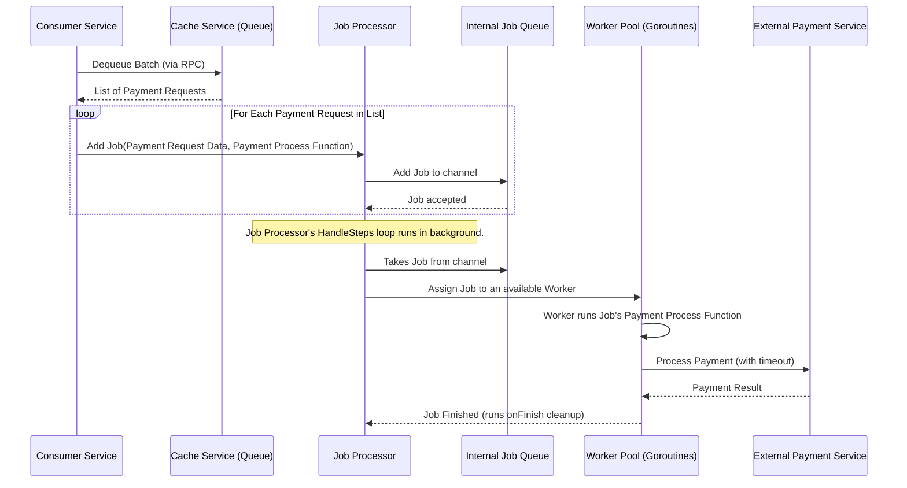

# Chapter 5: Concurrent Job Processor (Orchestrator)

Welcome back to the `rinha-backend-2025` tutorial! In [Chapter 1: Payment Request Data Model](01_payment_request_data_model_.md), we learned about our `PaymentRequest` "payment slip." In [Chapter 2: In-Memory Data Store (Cache/Queue)](02_in_memory_data_store__cache_queue__.md), we explored how these payment requests are stored temporarily in a super-fast queue within our dedicated `cache` service. And in [Chapter 4: Inter-Service RPC Communication](04_inter_service_rpc_communication_.md), we saw how our different services talk to this `cache` service.

Now, imagine our system is receiving hundreds or thousands of payment requests every second. They're all piling up nicely in our in-memory queue. But how do we *process* them quickly and efficiently without getting overwhelmed? We can't just process one payment at a time if we have thousands waiting!

### What Problem Are We Solving?

Think of our payment system's `consumer` service as a very busy post office sorting office. Mail (payment requests) arrives constantly and gets put into a large bin (our in-memory queue). If there's only one person sorting the mail, they'll quickly fall behind. The goal is to sort mail as fast as it comes in, ideally even faster!

The problem is that each payment request might take a little bit of time to process, especially if it needs to talk to an external bank or payment provider. If we wait for one payment to completely finish before starting the next, our queue will just keep growing and growing.

The **Concurrent Job Processor (Orchestrator)** solves this exact problem. It's like having a "team leader" in the sorting office who manages a group of "mail sorters." This team leader constantly grabs new mail from the main bin and assigns it to any available sorter. This way, many pieces of mail can be sorted *at the same time* (concurrently), making the whole process much faster and more efficient. It also ensures we don't assign too much work to the sorters at once, preventing them from getting overwhelmed.

Our central use case for this chapter is: **The `consumer` service needs to efficiently pick up multiple payment requests from the [In-Memory Data Store (Cache/Queue)](02_in_memory_data_store__cache_queue__.md) and process them *concurrently*, interacting with an external payment service, while managing processing limits and handling potential delays (timeouts).**

### Core Concept 1: The Job (Our Task Card)

Before we process anything, we need to define what a "task" looks like. In our system, each individual payment request that needs processing becomes a **Job**.

Think of a `Job` as a small "task card." Each card has:
*   An `ID`: A unique identifier (like the `CorrelationID` from our [Payment Request Data Model](01_payment_request_data_model_.md)) so we know which payment it is.
*   A `jobFunc`: The actual "work instructions" – a function that tells the system *how* to process this specific payment.

This `Job` is a simple Go `struct` defined in `pkg/services/orch/job.go`:

```go
// From pkg/services/orch/job.go (simplified)
package orch

import "context"

type Job struct {
	ID      string          // Unique ID for this job (e.g., payment CorrelationID)
	jobFunc func(ctx context.Context) error // The actual work to be done
}

// NewJob creates a new Job.
func NewJob(id string, jobFunc func(ctx context.Context) error) *Job {
	return &Job{
		ID:      id,
		jobFunc: jobFunc,
	}
}
```
*Explanation*: This code defines our `Job` structure. `ID` helps us track the payment, and `jobFunc` holds the specific steps for processing *that* payment (which will involve talking to the external payment service, as we'll see in [External Payment Service Interaction](06_external_payment_service_interaction_.md)).

### Core Concept 2: The Job Processor (The Orchestrator)

The **Job Processor** (also called the Orchestrator) is the "team leader" or "task manager." Its main job is to:
1.  Receive new `Job`s (task cards).
2.  Assign these `Job`s to a pool of available "workers" (Go `goroutines`).
3.  Make sure not too many `Job`s are running at the same time (limits concurrency).
4.  Handle timeouts, ensuring that if a job takes too long, it's stopped.

It's located in the `consumer` service, which is responsible for taking payment requests from the queue and actually processing them.

#### How the `consumer` Service Uses the Job Processor

The `consumer` service constantly fetches payment requests from the in-memory queue. When it gets a batch of requests, for each request, it creates a `Job` and gives it to the `JobProcessor`.

Here's a simplified look at how the `consumer` does this in `pkg/services/consumer/consumer.go`:

```go
// From pkg/services/consumer/consumer.go (simplified)

// ConsumerQueue continuously fetches and processes payment requests.
func (c *Consumer) ConsumerQueue() {
	for { // This loop runs forever, constantly checking for new payments
		// 1. Ask the cache service (via RPC) for a batch of payments.
		msgs, err := c.queue.DequeueBatch(context.TODO(), 30)
		if err != nil || msgs == nil {
			// Handle errors or empty queue by waiting a bit.
			time.Sleep(250 * time.Millisecond)
			continue
		}

		// Assume msgs is a batch of PaymentRequest pointers.
		// We get a 'dequeue' object containing a list of requests.
		dequeue := msgs.(*models.DequeueBatchRPC)

		// 2. For each payment request in the batch:
		for _, paymentRequestPtr := range dequeue.Requests {
			paymentRequest := *paymentRequestPtr

			// 3. Create a new Job (our "task card").
			// The jobFunc contains the actual payment processing logic.
			job := orch.NewJob(paymentRequest.CorrelationID, func(ctx context.Context) error {
				c.log.Debug("Processing payment", "id", paymentRequest.CorrelationID)
				// This is where the actual work for one payment happens.
				// (We'll see details in Chapter 6: External Payment Service Interaction)
				_, err := c.paymentClient.PaymentRequest(ctx, paymentRequest)
				if err != nil {
					// If processing fails, maybe put it back on the queue.
					c.queue.Enqueue(ctx, paymentRequestPtr)
				}
				return err
			})

			// 4. Add the Job to our Job Processor (Orchestrator).
			c.jobProcessor.AddJob(job)
		}
	}
}
```
*Explanation*: The `ConsumerQueue` function is the heart of our `consumer` service. It continuously tries to `DequeueBatch` payments from the queue (using [Inter-Service RPC Communication](04_inter_service_rpc_communication_.md) to talk to the `cache` service). For each `paymentRequest` it gets, it calls `orch.NewJob` to create a `Job` object. The `jobFunc` inside this `Job` is a special function that defines *what* needs to be done for this payment (e.g., calling an external payment service). Finally, `c.jobProcessor.AddJob(job)` hands this `Job` over to the `JobProcessor` for concurrent execution.

#### Inside the Job Processor: The Orchestration

The `JobProcessor` (Orchestrator) is set up to handle multiple jobs at once. Here's a simplified view of how it works inside `pkg/services/orch/orchestrator.go`:

1.  **Incoming Jobs Channel (`chanJobs`):** The `JobProcessor` has an internal channel, `chanJobs`, which acts like a small, fast internal queue just for jobs waiting to be assigned to workers. When `AddJob` is called, the `Job` is put into this channel.
    ```go
    // From pkg/services/orch/orchestrator.go (simplified)

    type JobProcessor struct {
        // This is where incoming jobs wait before being assigned to a worker.
        chanJobs chan *Job
        log      *slog.Logger
        // ... other settings like max parallel jobs, timeout ...
    }

    func NewJobProcessor(maxJobs int, jobTimeoutSec int, logger *slog.Logger) *JobProcessor {
        return &JobProcessor{
            chanJobs: make(chan *Job, maxJobs), // Create the channel with a buffer size
            log:      logger,
            // ...
        }
    }

    // AddJob simply puts a job into the internal channel.
    func (jp *JobProcessor) AddJob(job *Job) {
        jp.chanJobs <- job
    }
    ```
    *Explanation*: `chanJobs` is a buffered channel, meaning it can hold up to `maxJobs` items before it blocks. This allows `AddJob` to be very fast, as it doesn't always have to wait for a worker to be immediately free.

2.  **Job Dispatcher (`HandleSteps`):** A background loop in the `JobProcessor` (often called `HandleSteps`) constantly reads `Job`s from `chanJobs`. For each `Job` it pulls out, it then passes it to `evaluateJob`.
    ```go
    // From pkg/services/orch/orchestrator.go (simplified)

    func (jp *JobProcessor) HandleSteps(ctx context.Context, concurrency int) error {
        // This loop runs in a separate background "thread" (goroutine).
        // It continuously takes jobs from the 'chanJobs' channel.
        for job := range jp.chanJobs {
            jp.evaluateJob(ctx, job, concurrency) // Pass the job for evaluation
        }
        return nil
    }
    ```
    *Explanation*: This `for job := range jp.chanJobs` is a powerful Go pattern. It means "keep taking jobs from `chanJobs` as soon as they appear, until the channel is closed."

3.  **Worker Pool Manager (`jobTypeProcessor`):** `evaluateJob` then hands the `Job` to a `jobTypeProcessor`. This `jobTypeProcessor` is the actual "worker pool manager." It sets up a fixed number of "worker goroutines" (our "mail sorters") and gives them jobs.
    ```go
    // From pkg/services/orch/orchestrator.go (simplified)

    func (jp *JobProcessor) evaluateJob(ctx context.Context, job *Job, concurrency int) {
        // If this is the first job, set up our worker pool.
        if jp.processor == nil {
            // newStepTypeProcessor creates and starts a fixed number of worker goroutines.
            jp.processor = newStepTypeProcessor(ctx, WithMaxJobs(jp.parallelJobs*concurrency))
        }

        // Each job is wrapped with an 'executor' (the work) and 'onFinish' (cleanup).
        jp.processor.enqueue(jobProcess{
            executor: func() error {
                // This is the function that the worker goroutine will run.
                // It calls the actual jobFunc we defined (e.g., process payment).
                ctxTimeout, cancel := context.WithTimeout(context.TODO(),
                                         time.Duration(jp.jobTimeOutSec)*time.Second)
                defer cancel() // Important: release resources after timeout or completion.
                return job.jobFunc(ctxTimeout) // Execute the payment processing!
            },
            onFinish: func() {
                // This function is called when a job is done (success or fail).
                // It's useful for cleanup or updating counters.
                // For example, decrementing a counter of active jobs.
            },
        })
    }
    ```
    *Explanation*: `newStepTypeProcessor` (not shown in full here, but it's important!) starts a set number of Go `goroutines` (lightweight "threads") that will do the actual work. `jp.processor.enqueue` puts the `jobProcess` (our `Job` wrapped with `executor` and `onFinish` functions) into an internal channel of the `jobTypeProcessor` for these worker goroutines to pick up. The `context.WithTimeout` is crucial: if `job.jobFunc` (our payment processing) takes longer than `jp.jobTimeOutSec`, the context will cancel, and the `jobFunc` should stop, preventing payments from hanging forever.

4.  **Worker Goroutines (`process`):** Each "worker goroutine" runs a `process` function in a continuous loop. It takes a `jobProcess` from its internal channel, runs its `executor` function (the actual payment processing), and then calls its `onFinish` function.
    ```go
    // From pkg/services/orch/orchestrator.go (simplified)

    func (stp *jobTypeProcessor) process(ctx context.Context, group *sync.WaitGroup) {
        defer group.Done() // Signal that this worker is done when the function exits.
        for {
            select {
            case <-ctx.Done(): // If the main application context is cancelled, stop.
                return
            case job := <-stp.job: // Take a new job from the internal channel.
                func() {
                    defer func() {
                        if job.onFinish != nil {
                            job.onFinish() // Call the cleanup function.
                        }
                        // Update any internal counters, like total active jobs.
                    }()
                    err := job.executor() // Execute the actual job function!
                    job.result = err      // Store the result (success/error).
                }()
            }
        }
    }
    ```
    *Explanation*: This `process` function is what each "worker" in our pool does. The `select` statement means it waits for either the main application to shut down (`<-ctx.Done()`) or for a new `jobProcess` to arrive in its `stp.job` channel. When a job arrives, it runs the `executor` (our payment processing logic) and then calls `onFinish` to clean up.

#### Visualizing the Orchestration Flow

Let's put it all together with a diagram to see how a payment request goes from the queue to being processed concurrently:



### Why Is This Concurrent Job Processor So Important?

The Concurrent Job Processor (Orchestrator) is a cornerstone of an efficient and robust asynchronous system like `rinha-backend-2025`.

| Feature                   | Benefit in `rinha-backend-2025`                                            | Real-World Analogy                                   |
| :------------------------ | :------------------------------------------------------------------------- | :--------------------------------------------------- |
| **Concurrency/Parallelism** | Processes many payments at once, dramatically increasing throughput.       | Many mail sorters working simultaneously.            |
| **Resource Management**   | Limits how many payments are processed concurrently, preventing system overload. | Not hiring too many sorters for a small office.      |
| **Asynchronous Processing** | The `api` service quickly queues requests, and the `consumer` processes them in the background. | You order food and quickly get a receipt; the kitchen cooks later. |
| **Robustness (Timeouts)** | Prevents long-running or stuck payment processes from blocking others.    | A sorter knows to flag mail that's taking too long.  |
| **Efficiency**            | Keeps workers busy and handles bursts of incoming requests smoothly.       | A steady flow of mail to active sorters.             |
| **Error Handling**        | Allows for graceful error recovery, like re-queuing failed payments.       | A sorter putting undeliverable mail back in a "retry" bin. |

### Conclusion

In this chapter, we've unraveled the mystery of how `rinha-backend-2025` processes mountains of payment requests efficiently: through the **Concurrent Job Processor (Orchestrator)**. We learned that it acts like a smart "task manager," taking individual `Job`s (our payment requests), assigning them to a pool of "worker" `goroutines`, and managing their execution, including crucial aspects like limiting parallel operations and enforcing timeouts. This robust orchestration ensures that our `consumer` service can handle a high volume of payments without breaking a sweat, making our system highly performant.

Now that we know how payments are orchestrated for processing, our very next step is to understand what happens when these jobs actually execute: how our system interacts with external services to finalize the payment. We'll dive into this in the next chapter.

[Next Chapter: External Payment Service Interaction](06_external_payment_service_interaction_.md)

---

<sub><sup>Generated by [AI Codebase Knowledge Builder](https://github.com/The-Pocket/Tutorial-Codebase-Knowledge).</sup></sub> <sub><sup>**References**: [[1]](https://github.com/niltonkummer/rinha-backend-2025/blob/8ad9de259efb7a27c8d1e005f4b1dc5996c2b7d1/pkg/services/consumer/consumer.go), [[2]](https://github.com/niltonkummer/rinha-backend-2025/blob/8ad9de259efb7a27c8d1e005f4b1dc5996c2b7d1/pkg/services/orch/job.go), [[3]](https://github.com/niltonkummer/rinha-backend-2025/blob/8ad9de259efb7a27c8d1e005f4b1dc5996c2b7d1/pkg/services/orch/orchestrator.go)</sup></sub>