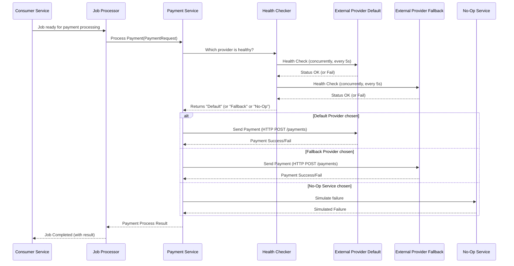

# Chapter 6: External Payment Service Interaction

Welcome back to the `rinha-backend-2025` tutorial! In our last chapter, [Chapter 5: Concurrent Job Processor (Orchestrator)](05_concurrent_job_processor__orchestrator_.md), we learned how our `consumer` service efficiently picks up many payment requests from the queue and prepares them to be processed concurrently. We now have a system that can handle a high volume of payments internally.

But what's the *final* step for a payment? It's the actual money transfer! Our system doesn't directly handle the money; it relies on external companies, like banks or specialized payment processors, to do that.

### What Problem Are We Solving?

Imagine our `rinha-backend-2025` system is a travel agency. We take your flight bookings and hotel reservations. But we don't own the airplanes or the hotels! We need to talk to airlines (like "FlyFast Airlines") and hotels (like "Cozy Inn") to actually make your booking.

There are a few challenges:
1.  **Different Providers:** We might work with multiple airlines or hotels. Each one might have a slightly different way of receiving booking requests.
2.  **Reliability:** What if "FlyFast Airlines" system is down for maintenance? We need to know that and try "Speedy Air" instead, or at least tell you there's a problem.
3.  **Sending Details:** We need to send all the correct details (your name, dates, payment info) to the chosen provider.

The **External Payment Service Interaction** component solves these problems for `rinha-backend-2025`. It acts as our "booking manager" for payments. It knows how to talk to different external payment providers, check their status, and ensure your payment details are sent reliably to one of them.

Our central use case for this chapter is: **The `consumer` service has a payment request ready for actual money transfer. It needs to send this request to an external payment provider and get a confirmation back, ensuring reliability even if one provider has issues.**

### Core Concept 1: The HTTP Request Service (Our "Mailroom")

Before we talk to *payment* services specifically, we need a general way to send messages (HTTP requests) over the internet to *any* external service. This is handled by our `request` service (in `pkg/services/request/request.go`).

Think of it as our internal "mailroom." You give it a letter (your payment data) and an address (the external service's URL), and it handles sending it out and bringing back the response. It doesn't care *what* the letter is about, just how to send it.

#### How to Send a Request

The main way we send data to external services is using the `Post` method.

```go
// From pkg/services/request/request.go (simplified)
package request

import (
	"context"
	"errors"
	"net/http" // For HTTP method constants like http.MethodPost
	"time"

	"github.com/goccy/go-json" // To convert Go objects to JSON
	"github.com/valyala/fasthttp" // A very fast HTTP client library
)

// RequestService defines the blueprint for sending HTTP requests.
type RequestService interface {
	Post(ctx context.Context, url string, body any, response any) (Response, error)
	Get(ctx context.Context, url string, response any) (Response, error)
}

// requestService implements the RequestService interface.
type requestService struct {
	baseURL string           // The base address of the external service (e.g., "https://api.example.com")
	client  *fasthttp.Client // The actual client that sends HTTP requests
	// ... other internal settings ...
}

// NewRequestService creates a new instance of our mailroom service.
func NewRequestService(baseUrl string, opts ...func(*options)) RequestService {
	// Sets up fasthttp.Client and other configurations.
	return &requestService{
		baseURL: baseUrl,
		client:  &fasthttp.Client{}, // A simple HTTP client
		options: &options{},
	}
}

// Post sends an HTTP POST request.
func (r *requestService) Post(ctx context.Context, uri string, body any, response any) (Response, error) {
	// ... (code to prepare the request, set headers, etc.) ...
	req := fasthttp.AcquireRequest()
	resp := fasthttp.AcquireResponse()
	defer func() { // Always release resources when done!
		fasthttp.ReleaseRequest(req)
		fasthttp.ReleaseResponse(resp)
	}()

	req.Header.SetMethod(http.MethodPost) // Set the request type to POST
	req.Header.Set("content-type", "application/json") // Tell the server we're sending JSON
	req.SetRequestURI(r.baseURL + uri) // Combine base URL with specific path (e.g., "/payments")
	
	// Convert our Go 'body' object (e.g., PaymentRequest) into JSON text.
	payload, err := json.Marshal(body)
	if err != nil {
		return Response{}, err
	}
	req.SetBody(payload) // Attach the JSON data to the request.

	// Actually send the request!
	err = fasthttp.Do(req, resp)
	if err != nil {
		return Response{}, err
	}
	
	// Check the response status code (e.g., 200 OK, 400 Bad Request, 500 Server Error)
	ret := Response{
		StatusCode: resp.StatusCode(),
		Message:    string(resp.Body()), // Get the raw response message
	}

	if !isSuccess(ret.StatusCode) { // isSuccess checks if status is 2xx
		return ret, errors.New("request failed: " + ret.Message)
	}

	// If a 'response' object was provided, try to fill it with the external service's JSON reply.
	if response != nil {
		if err := json.Unmarshal(resp.Body(), response); err != nil {
			return Response{}, err
		}
	}
	return ret, nil // Return the response and no error if successful.
}

// (Get method also exists for fetching data, similar to Post but for GET requests)
```
*Explanation*: The `requestService` uses `fasthttp` (a high-performance HTTP client library) to send requests. The `Post` method takes your data (`body`), converts it to JSON using `json.Marshal`, and sends it to the specified `uri`. It then checks the response, and if you provided a `response` object, it tries to fill that object with the JSON reply from the external service.

### Core Concept 2: The Payment Service Adapter (Our "Payment Router")

Now that we have a general "mailroom" (`request.RequestService`), we need a specific "payment router" (`pkg/services/payment/payment.go`) that understands *which* external payment provider to use (default or fallback) and how to talk to them for payment-related actions.

This `Service` is like the "payment desk" in our travel agency. It knows about "Provider A" and "Provider B" for payments.

```go
// From pkg/services/payment/payment.go (simplified)
package payment

import (
	"context"
	"errors"
	"log/slog"
	"niltonkummer/rinha-2025/pkg/models" // Our PaymentRequest model
	"niltonkummer/rinha-2025/pkg/services/request" // Our generic HTTP request service
	"time"
)

// Service POST payments and GET payments-summary from external providers.
type Service struct {
	Request         request.RequestService // Our default external payment provider
	RequestFallback request.RequestService // Our backup external payment provider
	log             *slog.Logger
}

// NewPaymentService creates a new PaymentService adapter.
func NewPaymentService(requestDefault, requestFallback request.RequestService,
	log *slog.Logger) *Service {
	s := &Service{
		Request:         requestDefault,
		RequestFallback: requestFallback,
		log:             log,
	}

	// This stores our providers for easy access by their "name" (Default, Fallback).
	providers = map[int]*ServiceStatus{
		Default: {
			request: s.Request,
		},
		Fallback: {
			request: s.RequestFallback,
		},
	}
	s.healthChecker() // Do an initial health check
	go s.HealthChecker() // Start the continuous health checker in the background
	return s
}

// PaymentRequest sends a payment request to the currently healthy external provider.
func (s *Service) PaymentRequest(ctx context.Context, request models.PaymentRequest) (any, error) {
	// 1. Ask the system which provider is currently healthy.
	requester := s.getHealthyRequest()
	s.log.Debug("Sending payment to provider", "provider", requester)

	// 2. Use the chosen provider's HTTP RequestService to POST the payment.
	response, err := requester.request.Post(ctx, "/payments", request, nil)
	if err != nil {
		s.log.Error("Failed to send payment", "err", err)
		return nil, err
	}
	return response, nil // Return the response from the external provider.
}
```
*Explanation*: The `PaymentService` holds two `RequestService` instances: one for the `Default` payment provider and one for a `Fallback` provider. The `NewPaymentService` sets them up and importantly starts a background `HealthChecker` (more on this next!). The `PaymentRequest` method is the one our `consumer` service calls. It first calls `s.getHealthyRequest()` to decide *which* external provider to use, then uses that provider's `request.Post` method to send the payment.

### Core Concept 3: Health Checks and Provider Switching (Our "Status Board")

What if our "FlyFast Airlines" provider goes down? We need to know this quickly so we can automatically switch to "Speedy Air." This is handled by the **Health Checker** and `getHealthyRequest` logic in `pkg/services/payment/health.go` and `payment.go`.

This is like a "status board" that constantly checks if our preferred airlines/hotels are open for business. If the default one closes, it automatically flips a switch to use the backup!

#### Continuous Health Checks

```go
// From pkg/services/payment/health.go (simplified)
package payment

import (
	"context"
	"log/slog"
	"niltonkummer/rinha-2025/pkg/models"
	"niltonkummer/rinha-2025/pkg/services/request"
	"sync"
	"sync/atomic" // For safely counting failures across different parts of the code
	"time"
)

// ServiceStatus holds the details and health of a single external provider.
type ServiceStatus struct {
	request       request.RequestService // The HTTP client for this provider
	totalFailures atomic.Int32           // How many times this provider has failed recently
	healthStatus  models.HealthResponse  // The last health check response
}

var (
	Default  = 0 // Identifier for our default provider
	Fallback = 1 // Identifier for our fallback provider
	// 'providers' map (global) stores the status for each provider
	providers = map[int]*ServiceStatus{}
)

// HealthChecker is a loop that continuously checks the health of all providers.
func (s *Service) HealthChecker() {
	for { // This loop runs forever in the background
		time.Sleep(5 * time.Second) // Check every 5 seconds
		s.healthChecker()           // Perform the actual health check
	}
}

// healthChecker performs a single health check for all configured providers.
func (s *Service) healthChecker() {
	wg := &sync.WaitGroup{}
	wg.Add(len(providers)) // Wait for all providers to be checked
	for name, provider := range providers {
		go func(name int, provider *ServiceStatus) { // Check each provider in a separate goroutine (concurrently!)
			defer wg.Done() // Signal when this check is done.

			response := models.HealthResponse{}
			// Set a timeout for the health check itself (5 seconds).
			ctxWithTimeout, cancel := context.WithTimeout(context.Background(), 5*time.Second)
			defer cancel()

			// Send a GET request to the provider's health endpoint.
			res, err := provider.request.Get(ctxWithTimeout, "/payments/service-health", &response)
			if err != nil {
				// If there's an error (e.g., connection refused), increment failure count.
				provider.totalFailures.Add(1)
				slog.Warn("Health check failed", "provider", name, "error", err)
				return
			}
			// If the provider returned a 4xx or 5xx status code, it's also a failure.
			if res.StatusCode/100 == 4 || res.StatusCode/100 == 5 {
				provider.totalFailures.Add(1)
				slog.Warn("Health check non-success status", "provider", name, "status", res.StatusCode)
				return
			}
			
			// If successful, reset failures and update health status.
			provider.totalFailures.Store(0) // Reset failures if it's healthy now.
			provider.healthStatus = response // Store the detailed health response.
			slog.Debug("Health check success", "provider", name, "status", response.Failing)
		}(name, provider) // Pass name and provider to the goroutine
	}
	wg.Wait() // Wait for all concurrent health checks to complete.
	slog.Info("Health Summary", "default_failures", providers[Default].totalFailures.Load(), "fallback_failures", providers[Fallback].totalFailures.Load())
}
```
*Explanation*: The `HealthChecker` function runs in the background. Every 5 seconds, it uses `healthChecker` to concurrently ping both our `Default` and `Fallback` payment providers by sending a `GET` request to their `/payments/service-health` endpoint. If a provider fails to respond or responds with an error status, its `totalFailures` count is increased. If it succeeds, the `totalFailures` count is reset to zero. This gives us a real-time understanding of each provider's reliability.

#### Choosing the Healthy Provider

When a payment actually needs to be processed, the `getHealthyRequest` function decides which provider to use based on the latest health checks:

```go
// From pkg/services/payment/payment.go (simplified)

// noopService is a special "do nothing" service, used as a last resort.
var noopService = &ServiceStatus{
	request: noop{}, // 'noop' is a dummy request service that always fails after a short delay.
}

// getHealthyRequest determines which external payment provider to use.
func (s *Service) getHealthyRequest() (requester *ServiceStatus) {
	status := providers // Get the latest health status of all providers.

	// Rule 1: If the default provider has failed too many times (e.g., more than 12 times in a minute, since checks are every 5s)
	// then automatically switch to the fallback provider.
	if status[Default].totalFailures.Load() > 12 { // 12 * 5s = 60s outage
		s.log.Warn("Default provider failing frequently, switching to Fallback.")
		return providers[Fallback]
	}

	// Rule 2: If *both* default and fallback providers are reporting as "Failing" (based on their own health responses).
	if status[Default].healthStatus.Failing && status[Fallback].healthStatus.Failing {
		s.log.Error("Both default and fallback providers are failing. Using No-Op service.")
		return noopService // Use the "do nothing" service to prevent requests from hanging.
	}

	// Rule 3: Otherwise, if Default is not failing too much, use it.
	return providers[Default]
}

// noop is a dummy implementation of RequestService that always returns an error.
// It's a "circuit breaker" to prevent requests from piling up if all external services are down.
type noop struct {}
func (n noop) Post(ctx context.Context, url string, body any, response any) (request.Response, error) {
	time.Sleep(time.Millisecond * 100) // Simulate a tiny delay
	return request.Response{}, errors.New("cooldown: external services unavailable")
}
func (n noop) Get(ctx context.Context, url string, response any) (request.Response, error) {
	return request.Response{}, errors.New("noop")
}
```
*Explanation*: `getHealthyRequest` is our "decision maker."
1.  It first checks the `totalFailures` of the `Default` provider. If it's been consistently failing (more than 12 times, or 60 seconds of failures), it automatically returns the `Fallback` provider's `ServiceStatus`.
2.  If both `Default` and `Fallback` providers are reporting `Failing` status (which they tell us in their health check response), it returns `noopService`. The `noopService` is a special dummy service that immediately returns an error. This acts as a "circuit breaker," preventing our system from continuously sending requests to external services that are clearly down, saving resources and failing fast.
3.  Otherwise, if the `Default` provider seems okay, it's chosen.

This ensures that payments are always attempted with the healthiest available provider, or gracefully failed if no provider is available.

### The Full Journey: From Orchestrated Job to External Payment

Let's visualize the entire journey of a payment request from when the [Concurrent Job Processor (Orchestrator)](05_concurrent_job_processor__orchestrator_.md) picks it up, until it's processed by an external service:



### Why Is External Payment Service Interaction So Important?

This component is critical for the reliability and robustness of `rinha-backend-2025`:

| Feature                   | Benefit in `rinha-backend-2025`                                            | Real-World Analogy                                   |
| :------------------------ | :------------------------------------------------------------------------- | :--------------------------------------------------- |
| **Reliability/Fault Tolerance** | Automatically switches to a backup provider if the primary fails.        | If your favorite coffee shop is closed, you go to another. |
| **Separation of Concerns** | Our system doesn't deal with the complexity of external APIs directly.     | A receptionist handles calls, not the CEO.           |
| **Graceful Degradation**  | Uses a `noop` service to prevent requests from piling up if all providers are down. | If all roads are closed, you don't keep trying to drive. |
| **Centralized Logic**     | All external payment interaction logic is in one place, easy to manage.    | One department handles all external vendor relations. |
| **Configurability**       | Can easily add or change external payment providers by updating config.    | Easily swap suppliers if one isn't working out.      |

### Conclusion

In this chapter, we've explored the crucial **External Payment Service Interaction** component. We learned how `rinha-backend-2025` acts as a smart "payment router," using a generic HTTP `request` service to communicate with external payment providers. Crucially, we saw how it employs a sophisticated **Health Checker** and **provider switching logic** to automatically select the healthiest available provider (default, fallback, or even a `noop` "circuit breaker") ensuring that our payment system remains reliable and resilient even when external services face issues. This means payments are always reliably sent, or gracefully handled if impossible.

Now that we understand how payments are finally processed with external services, our next step is to explore how we keep track of how well our system is performing, in real-time. We'll dive into this in the next chapter.

[Next Chapter: Real-time Performance Statistics](07_real_time_performance_statistics_.md)

---

<sub><sup>Generated by [AI Codebase Knowledge Builder](https://github.com/The-Pocket/Tutorial-Codebase-Knowledge).</sup></sub> <sub><sup>**References**: [[1]](https://github.com/niltonkummer/rinha-backend-2025/blob/8ad9de259efb7a27c8d1e005f4b1dc5996c2b7d1/infra/config/config.go), [[2]](https://github.com/niltonkummer/rinha-backend-2025/blob/8ad9de259efb7a27c8d1e005f4b1dc5996c2b7d1/pkg/services/payment/health.go), [[3]](https://github.com/niltonkummer/rinha-backend-2025/blob/8ad9de259efb7a27c8d1e005f4b1dc5996c2b7d1/pkg/services/payment/payment.go), [[4]](https://github.com/niltonkummer/rinha-backend-2025/blob/8ad9de259efb7a27c8d1e005f4b1dc5996c2b7d1/pkg/services/request/request.go)</sup></sub>