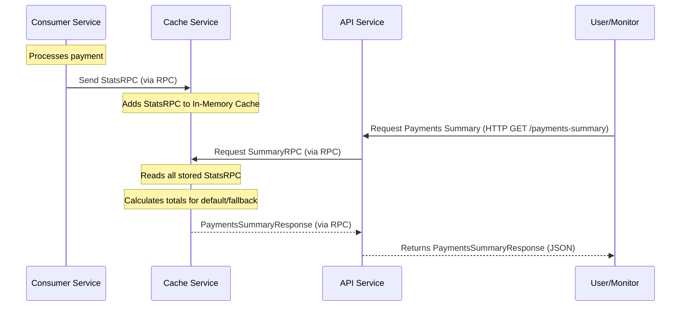

# Chapter 7: Real-time Performance Statistics

Welcome back to the `rinha-backend-2025` tutorial! In our last chapter, [Chapter 6: External Payment Service Interaction](06_external_payment_service_interaction_.md), we explored how our system reliably sends payment requests to external providers, even switching to a backup if needed. At this point, payments are flowing, being queued, processed, and finalized!

But how do we know if our system is actually *doing well*? Is it processing payments fast enough? Are we relying too much on the backup payment provider because the main one is having issues? To answer these questions, we need to monitor our system's performance.

### What Problem Are We Solving?

Imagine our payment system is a busy factory. Products (payments) are constantly moving through. If you just watch the factory floor, you might see things moving, but you won't know:
1.  **Total Output**: How many products were made in the last hour?
2.  **Efficiency**: How much raw material (money) was processed?
3.  **Bottlenecks**: Which production line (payment provider) is doing most of the work, and is one failing more often?

Without this information, it's impossible to tell if the factory is healthy, efficient, or if something is going wrong.

The **Real-time Performance Statistics** abstraction solves this problem. It's like adding a dashboard to our factory that constantly updates with vital numbers. It collects metrics (like counts and amounts) right as payments are processed, stores them quickly in memory, and makes them available for immediate viewing. This allows us to monitor the health and efficiency of our payment processing system and make smart decisions.

Our central use case for this chapter is: **To collect and view real-time statistics about processed payments (total requests, total amount) for both default and fallback payment providers, enabling quick insights into system performance and provider usage.**

### Core Concept 1: What Are Performance Statistics?

In our system, performance statistics are simple numbers that tell us about the work done:
*   **Total Number of Requests**: How many individual payment requests have we processed?
*   **Total Amount Processed**: What is the sum of all money values across those processed payments?
*   **Provider Specifics**: We track these stats separately for payments processed by our `default` external provider and those handled by our `fallback` provider. This helps us understand if we're unexpectedly relying on the fallback.

These statistics are encapsulated in a `models.StatsRPC` data model:

```go
// From pkg/models/models.go (simplified)
package models

import (
	"github.com/shopspring/decimal"
	"time"
)

// StatsRPC represents a single payment processing statistic.
type StatsRPC struct {
	CorrelationID string          // Which payment this stat is about
	Amount        decimal.Decimal // The money value of this payment
	Fallback      bool            // Was this processed by the fallback provider?
	CreatedAt     time.Time       // When was this payment processed?
}

// PaymentsSummary represents aggregated statistics for one provider.
type PaymentsSummary struct {
	TotalRequests int             `json:"totalRequests"`
	TotalAmount   decimal.Decimal `json:"totalAmount"`
}

// PaymentsSummaryResponse contains aggregated stats for both providers.
type PaymentsSummaryResponse struct {
	Default  PaymentsSummary `json:"default"`
	Fallback PaymentsSummary `json:"fallback"`
}
```
*Explanation*: The `StatsRPC` struct is what our `consumer` service sends whenever it processes a payment. It tells us the payment's ID, amount, whether the fallback was used, and when it happened. The `PaymentsSummary` and `PaymentsSummaryResponse` are used when we *ask* for a report; they combine many `StatsRPC` entries into a total count and amount, broken down by provider.

### Core Concept 2: Collecting Statistics (The `consumer`'s Job)

The `consumer` service, which actually processes the payments using the [Concurrent Job Processor (Orchestrator)](05_concurrent_job_processor__orchestrator_.md) and the [External Payment Service Interaction](06_external_payment_service_interaction_.md), is the ideal place to collect these statistics. Once a payment is successfully processed, the `consumer` sends a `StatsRPC` message.

**How does it send it?** Via **RPC**! As we learned in [Chapter 4: Inter-Service RPC Communication](04_inter_service_rpc_communication_.md), our services talk to each other using RPC (Remote Procedure Call). The `consumer` uses an RPC client to send these `StatsRPC` messages to the `cache` service.

Here's how the `consumer` service adds a statistic after processing a payment:

```go
// From pkg/services/consumer/consumer.go (simplified)

// ConsumerQueue continuously fetches and processes payment requests.
func (c *Consumer) ConsumerQueue() {
	for {
		// ... (code to dequeue payment and process with external service) ...
		_, err := c.paymentClient.PaymentRequest(context.TODO(), paymentRequest) // Payment processed!

		if err == nil { // If payment processing was successful
			// Send a statistic to the cache service via RPC.
			c.stats.InsertStats(
				paymentRequest.CorrelationID,
				paymentRequest.Amount,
				// This 'isFallback' flag comes from the payment service
				// telling us which provider was used.
				paymentRequest.Fallback,
				paymentRequest.RequestedAt,
			)
		} else {
			// If payment failed, handle it (e.g., log error, maybe re-queue).
			c.log.Error("Failed to process payment", "id", paymentRequest.CorrelationID, "error", err)
			c.queue.Enqueue(context.TODO(), &paymentRequest) // Put it back for retry
		}
		// ...
	}
}
```
*Explanation*: After the `c.paymentClient.PaymentRequest` successfully completes (meaning the external payment service processed it), the `consumer` calls `c.stats.InsertStats`. This `InsertStats` method is actually an RPC call (provided by `infra/rpc/stats.go`) that sends our `StatsRPC` data to the `cache` service. This is a very fast, non-blocking operation, so it doesn't slow down the payment processing.

Let's look at the RPC client side in `infra/rpc/stats.go`:

```go
// From infra/rpc/stats.go (simplified)
package rpc

import (
	"github.com/shopspring/decimal"
	"github.com/valyala/gorpc"
	"niltonkummer/rinha-2025/pkg/models"
	"time"
)

type rpcStatsAdapter struct {
	rpcClient *gorpc.Client // Our RPC phone line to the cache service!
}

// NewStats creates an adapter to send statistics via RPC.
func NewStats(rpcClient *gorpc.Client) *rpcStatsAdapter {
	return &rpcStatsAdapter{
		rpcClient: rpcClient,
	}
}

// InsertStats sends a new statistic to the remote cache service.
func (s *rpcStatsAdapter) InsertStats(correlationID string, amount decimal.Decimal, fallback bool, requestedAt time.Time) error {
	// Package the stat data into a models.StatsRPC object.
	statsMsg := &models.StatsRPC{
		CorrelationID: correlationID,
		Amount:        amount,
		Fallback:      fallback,
		CreatedAt:     requestedAt,
	}
	// Use the gorpc client to send this message.
	_, err := s.rpcClient.Call(statsMsg)
	if err != nil {
		return err
	}
	return nil
}
```
*Explanation*: The `InsertStats` function takes the payment details, creates a `models.StatsRPC` object, and then uses `s.rpcClient.Call` to send it over the network to the `cache` service. The `cache` service is waiting to receive these.

### Core Concept 3: Storing Statistics (The `cache`'s Job)

As we learned in [Chapter 2: In-Memory Data Store (Cache/Queue)](02_in_memory_data_store__cache_queue__.md), the `cache` service is designed for fast, temporary in-memory storage. It has an "In-Memory Cache" component perfect for accumulating these `StatsRPC` messages.

When the `cache` service receives an `StatsRPC` via RPC, its `HandleRPC` function (its "switchboard," as we saw in [Chapter 4](04_inter_service_rpc_communication_.md)) directs it to be added to its internal cache.

```go
// From pkg/services/handler/handler.go (simplified for CacheHandler)
package handler

import (
	"context"
	"log/slog"
	"niltonkummer/rinha-2025/pkg/adapters"
	"niltonkummer/rinha-2025/pkg/models"
	"niltonkummer/rinha-2025/pkg/services/cache" // Our in-memory cache component
	"time"
)

type CacheHandler struct {
	cache adapters.Cache // Our in-memory cache
	queue cache.Queue
	log   *slog.Logger
}

// HandleRPC processes RPC requests for payment handling.
func (h *CacheHandler) HandleRPC(request any) any {
	switch req := request.(type) {
	case *models.StatsRPC: // If it's a StatsRPC message
		h.log.Debug("Received StatsRPC request", "req", req)
		h.AddStat(req) // Call the function to add it to the cache.
		return request // Acknowledge receipt.
	// ... other cases like EnqueueRPC, DequeueRPC, SummaryRPC ...
	}
	return request
}

// AddStat adds a received statistic to the in-memory cache.
func (h *CacheHandler) AddStat(stats *models.StatsRPC) {
	h.cache.Add(stats) // This uses the cache.Service's Add method.
}
```
*Explanation*: When a `StatsRPC` message arrives, `HandleRPC` identifies it and calls `h.AddStat`. This function then simply calls `h.cache.Add(stats)`, which appends the `StatsRPC` object to the internal list within the `cache` service's in-memory storage. This is incredibly fast as it's just adding to a Go slice in RAM.

### Core Concept 4: Retrieving Statistics (The `api`'s Job)

To see our real-time performance statistics, we need a way to ask the `cache` service for a summary. The `api` service (which handles our [API Gateway & HTTP Endpoint Handling](03_api_gateway___http_endpoint_handling_.md)) provides an HTTP endpoint (`/payments-summary`) for this.

When a user requests this summary, the `api` service:
1.  Sends an RPC request (a `models.SummaryRPC` message) to the `cache` service.
2.  The `cache` service processes all the individual `StatsRPC` entries it has stored and calculates totals for `default` and `fallback` providers for a given time period.
3.  The `cache` service sends back a `models.PaymentsSummaryResponse` via RPC.
4.  The `api` service then sends this summary back to the user as a JSON response.

Here's how the `api` service requests the summary via RPC:

```go
// From pkg/services/handler/handler.go (simplified for PaymentHandler)
package handler

import (
	"niltonkummer/rinha-2025/pkg/adapters"
	"niltonkummer/rinha-2025/pkg/models"
	"time"
	"log/slog"
)

type PaymentHandler struct {
	stats         adapters.StatsAdapter // This is our RPC adapter for stats!
	statsFallback adapters.StatsAdapter // (Not directly used for summary retrieval)
	log           *slog.Logger
	// ... other fields
}

// HandlePaymentsSummary retrieves a summary of payments from the cache service.
func (h *PaymentHandler) HandlePaymentsSummary(start, end time.Time) (*models.PaymentsSummaryResponse, error) {
	// Call the RPC adapter to retrieve the total stats by period.
	// This sends a SummaryRPC message to the cache service and waits for a response.
	summary, err := h.stats.RetrieveTotalStatsByPeriod(false, start, end) // 'false' for default, but the RPC handles both
	if err != nil {
		h.log.Error("Failed to retrieve total stats by period", "error", err)
		return nil, err
	}
	return summary, nil
}
```
*Explanation*: When the API endpoint for summary is hit, `HandlePaymentsSummary` calls `h.stats.RetrieveTotalStatsByPeriod`. This is another RPC call to the `cache` service. The `start` and `end` times are sent along so the `cache` service knows which period to summarize.

And how the `cache` service calculates and returns the summary:

```go
// From pkg/services/handler/handler.go (simplified for CacheHandler)

// HandleRPC processes RPC requests.
func (h *CacheHandler) HandleRPC(request any) any {
	switch req := request.(type) {
	// ... case for StatsRPC, EnqueueRPC, DequeueRPC ...
	case *models.SummaryRPC: // If it's a SummaryRPC message
		// Call GetStats to calculate the summary from stored items.
		summary, err := h.GetStats(req.Start, req.End)
		if err != nil {
			h.log.Error("Failed to retrieve stats", "error", err)
			return nil
		}
		return summary // Send the calculated summary back as the RPC response.
	}
	return request
}

// GetStats calculates the summary from all stored individual statistics.
func (h *CacheHandler) GetStats(start, end time.Time) (*models.PaymentsSummaryResponse, error) {
	list, err := h.cache.GetList() // Get ALL individual StatsRPC entries from cache.
	if err != nil {
		return nil, err
	}

	defaultSummary := models.PaymentsSummary{}
	fallbackSummary := models.PaymentsSummary{}

	// Loop through each individual statistic collected.
	for _, item := range list {
		if stat, ok := item.(*models.StatsRPC); ok { // Make sure it's a StatsRPC object
			// Check if the stat falls within the requested time period.
			if stat.CreatedAt.After(start) && stat.CreatedAt.Before(end) {
				if stat.Fallback { // Is this a fallback payment?
					fallbackSummary.TotalRequests++
					fallbackSummary.TotalAmount = fallbackSummary.TotalAmount.Add(stat.Amount)
				} else { // It's a default payment.
					defaultSummary.TotalRequests++
					defaultSummary.TotalAmount = defaultSummary.TotalAmount.Add(stat.Amount)
				}
			}
		}
	}
	// Combine both default and fallback summaries into the final response.
	summaryResponse := &models.PaymentsSummaryResponse{
		Default:  defaultSummary,
		Fallback: fallbackSummary,
	}
	return summaryResponse, nil
}
```
*Explanation*: When `HandleRPC` receives a `SummaryRPC` request, it calls `h.GetStats`. This function first gets *all* the individual `StatsRPC` entries from the `cache`'s in-memory list (using `h.cache.GetList()`, as discussed in [Chapter 2](02_in_memory_data_store__cache_queue__.md)). Then, it loops through each one, filters by the requested `start` and `end` times, and aggregates the `TotalRequests` and `TotalAmount` separately for default and fallback payments. Finally, it returns the combined `PaymentsSummaryResponse`.

### The Full Cycle: From Payment to Dashboard

Let's visualize how performance statistics are collected and retrieved:



### Why Are Real-time Performance Statistics So Important?

Real-time performance statistics are vital for maintaining a healthy and efficient system:

| Feature                   | Benefit in `rinha-backend-2025`                                            | Real-World Analogy                                   |
| :------------------------ | :------------------------------------------------------------------------- | :--------------------------------------------------- |
| **Instant Visibility**    | See system health and efficiency immediately as payments are processed.    | A car dashboard showing speed and fuel level right now. |
| **Proactive Monitoring**  | Quickly detect issues (e.g., a provider failing, high processing volume).  | Seeing a "low fuel" warning before you run out.      |
| **Decision Making**       | Helps in determining which external payment provider is performing better. | Choosing the best route based on real-time traffic.  |
| **Troubleshooting**       | Pinpoint when and where problems might be occurring.                       | Checking engine temperature to diagnose an issue.    |
| **Capacity Planning**     | Understand peak loads and plan for future scaling.                         | Knowing how many customers you can serve effectively. |

### Conclusion

In this final chapter, we've explored **Real-time Performance Statistics**, understanding how `rinha-backend-2025` keeps its finger on the pulse of payment processing. We learned that the `consumer` service collects individual payment statistics (`StatsRPC`) after successful processing and sends them via RPC to the `cache` service. The `cache` service then stores these in its super-fast in-memory store and, when requested by the `api` service (via another RPC call), aggregates them into a comprehensive `PaymentsSummaryResponse` that includes totals for both default and fallback providers. This real-time data is crucial for monitoring system health, making informed decisions about payment provider usage, and ensuring the overall efficiency of our payment processing factory.

This concludes our tutorial for `rinha-backend-2025`! You've now learned about the core components that make up this high-performance payment system, from data modeling to external interactions and real-time monitoring.

---

<sub><sup>Generated by [AI Codebase Knowledge Builder](https://github.com/The-Pocket/Tutorial-Codebase-Knowledge).</sup></sub> <sub><sup>**References**: [[1]](https://github.com/niltonkummer/rinha-backend-2025/blob/8ad9de259efb7a27c8d1e005f4b1dc5996c2b7d1/infra/rpc/stats.go), [[2]](https://github.com/niltonkummer/rinha-backend-2025/blob/8ad9de259efb7a27c8d1e005f4b1dc5996c2b7d1/pkg/services/handler/handler.go), [[3]](https://github.com/niltonkummer/rinha-backend-2025/blob/8ad9de259efb7a27c8d1e005f4b1dc5996c2b7d1/pkg/services/stats/http_stats.go), [[4]](https://github.com/niltonkummer/rinha-backend-2025/blob/8ad9de259efb7a27c8d1e005f4b1dc5996c2b7d1/pkg/services/stats/stats.go)</sup></sub>