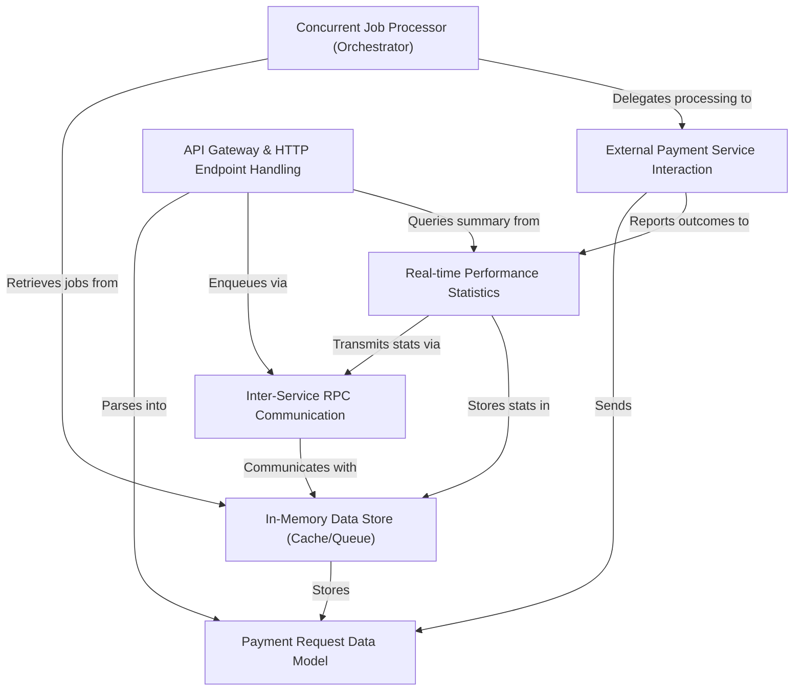

# Tutorial: rinha-backend-2025

This project is a **high-speed payment processing system** designed to handle a large volume of transactions. When a payment request comes in, it's quickly *stored in an in-memory queue*. Then, specialized "worker" components *pick up these payments for parallel processing*, interacting with external payment services. All the while, the system *tracks real-time performance statistics* to ensure smooth operation and aid in decision-making.

## Visual Overview

## Chapters

1. [Payment Request Data Model
   ](01_payment_request_data_model_.md)
2. [In-Memory Data Store (Cache/Queue)
   ](02_in_memory_data_store__cache_queue__.md)
3. [API Gateway & HTTP Endpoint Handling
   ](03_api_gateway___http_endpoint_handling_.md)
4. [Inter-Service RPC Communication
   ](04_inter_service_rpc_communication_.md)
5. [Concurrent Job Processor (Orchestrator)
   ](05_concurrent_job_processor__orchestrator__.md)
6. [External Payment Service Interaction
   ](06_external_payment_service_interaction_.md)
7. [Real-time Performance Statistics
   ](07_real_time_performance_statistics_.md)

---